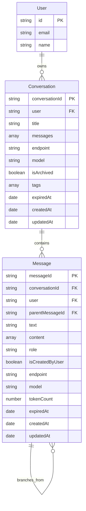

# LibreChat Conversation Flow: Complete Architectural Analysis

**Version**: 2.0  
**Date**: June 2025 
**Scope**: Complete conversation system architecture from database to frontend UI  
**Purpose**: Definitive reference for agentic-driven development and system understanding

---

## Table of Contents

1. [System Overview](#system-overview)
2. [Data Architecture](#data-architecture)
3. [API Layer Analysis](#api-layer-analysis)
4. [Frontend Architecture](#frontend-architecture)
5. [Real-time Communication](#real-time-communication)
6. [Authentication & Authorization](#authentication--authorization)
7. [External Message Integration](#external-message-integration)
8. [LLM Provider Integration](#llm-provider-integration)
9. [State Management](#state-management)
10. [Data Flow Patterns](#data-flow-patterns)
11. [Performance & Scalability](#performance--scalability)
12. [Error Handling](#error-handling)
13. [Extension Points](#extension-points)
14. [Implementation Details](#implementation-details)

---

## System Overview

LibreChat implements a **multi-layered conversation system** designed for scalability, real-time communication, and extensive LLM provider support. The architecture follows a clear separation of concerns with distinct layers for data persistence, business logic, real-time communication, and user interface.

### Core Architecture Principles

1. **Layered Architecture**: Clear separation between data, API, real-time, and presentation layers
2. **Event-Driven Communication**: SSE-based real-time updates with client registry management
3. **Provider Agnostic Design**: Dynamic LLM provider routing and initialization
4. **Dual Authentication Model**: JWT for users, API keys for external systems
5. **Extensible Plugin System**: Modular components for custom functionality
6. **State Synchronization**: Frontend state management synchronized with backend data

### Technology Stack

**Backend:**
- Node.js with Express.js framework
- MongoDB with Mongoose ODM
- MeiliSearch for full-text search
- Server-Sent Events (SSE) for real-time communication
- JWT authentication with Passport.js

**Frontend:**
- React with TypeScript
- Recoil for state management
- React Query for server state management
- React Router for navigation
- Tailwind CSS for styling

**Data Layer:**
- MongoDB collections: conversations, messages, users, files
- MeiliSearch indexes: conversations, messages
- In-memory SSE client registry
- Local storage for client-side caching

---

## Data Architecture

### Database Schema Analysis

#### Conversation Schema (`packages/data-schemas/src/schema/convo.ts`)

```typescript
interface IConversation {
  // Core identifiers
  conversationId: string;          // UUID primary key, indexed
  user: string;                    // User ownership, indexed
  title: string;                   // Display title, default "New Chat"
  
  // Message relationships
  messages: Types.ObjectId[];      // References to Message documents
  
  // LLM Configuration
  endpoint?: string;               // Provider identifier (openai, anthropic, etc.)
  endpointType?: string;           // Provider variant
  model?: string;                  // Specific model name
  agent_id?: string;               // Agent reference for agent endpoints
  assistant_id?: string;           // Assistant reference for assistant endpoints
  
  // Model Parameters (inherited from conversationPreset)
  temperature?: number;
  top_p?: number;
  topP?: number;
  topK?: number;
  maxOutputTokens?: number;
  maxTokens?: number;
  presence_penalty?: number;
  frequency_penalty?: number;
  stop?: string[];
  
  // Conversation Management
  isArchived?: boolean;            // Archive status
  tags?: string[];                 // User-defined tags, indexed
  files?: string[];                // Attached file references
  
  // Lifecycle Management
  expiredAt?: Date;                // TTL for temporary conversations
  createdAt?: Date;                // Creation timestamp
  updatedAt?: Date;                // Last modification timestamp
}
```

**Key Indexes:**
```javascript
// Primary lookup
{ conversationId: 1, user: 1 } // Unique compound index

// Performance indexes
{ expiredAt: 1 } // TTL cleanup
{ createdAt: 1, updatedAt: 1 } // Timeline queries
{ conversationId: 1 } // Fast conversation lookup
{ user: 1 } // User conversations
```

#### Message Schema (`packages/data-schemas/src/schema/message.ts`)

```typescript
interface IMessage {
  // Core identifiers
  messageId: string;               // UUID primary key, indexed
  conversationId: string;          // Parent conversation, indexed
  user: string;                    // User ownership, indexed
  parentMessageId?: string;        // Thread structure for branching
  
  // Content
  text?: string;                   // Plain text content, indexed for search
  content?: unknown[];             // Rich content array (text, images, etc.)
  role: 'user' | 'assistant' | 'system' | 'external';
  
  // Metadata
  isCreatedByUser: boolean;        // Authorship flag
  sender?: string;                 // Display name, indexed
  endpoint?: string;               // LLM provider
  model?: string;                  // Model used for generation
  
  // Token tracking
  tokenCount?: number;             // Total tokens consumed
  summaryTokenCount?: number;      // Summary-specific tokens
  
  // Provider-specific fields
  conversationSignature?: string;  // Bing/Edge signature
  clientId?: string;               // Bing client ID
  invocationId?: number;           // Bing invocation counter
  thread_id?: string;              // Assistant thread reference
  
  // Status tracking
  unfinished?: boolean;            // Streaming completion status
  error?: boolean;                 // Error state flag
  finish_reason?: string;          // Completion reason
  
  // Rich content
  files?: unknown[];               // Attached files
  attachments?: unknown[];         // Message attachments
  
  // Plugin system
  plugin?: {
    latest?: string;
    inputs?: unknown[];
    outputs?: string;
  };
  plugins?: unknown[];             // Plugin execution results
  
  // UI elements
  iconURL?: string;                // Display icon
  
  // Lifecycle
  expiredAt?: Date;                // TTL for temporary messages
  createdAt?: Date;                // Creation timestamp
  updatedAt?: Date;                // Last modification timestamp
}
```

**Key Indexes:**
```javascript
// Primary operations
{ messageId: 1, user: 1 } // Unique compound index

// Query optimization
{ conversationId: 1, user: 1 } // Conversation messages
{ user: 1, createdAt: -1 } // User timeline
{ expiredAt: 1 } // TTL cleanup
```

### Data Relationships



---

## API Layer Analysis

### Route Structure

```
/api/
├── messages/                    # Message operations
│   ├── GET    /                 # Search and retrieve messages
│   ├── GET    /stream          # SSE endpoint for real-time updates
│   ├── GET    /:conversationId # Get conversation messages
│   ├── POST   /:conversationId # Create new message
│   ├── GET    /:conversationId/:messageId # Get specific message
│   ├── PUT    /:conversationId/:messageId # Update message
│   ├── DELETE /:conversationId/:messageId # Delete message
│   └── POST   /artifact/:messageId # Edit message artifacts
├── convos/                      # Conversation operations
│   ├── GET    /                 # List conversations with pagination
│   ├── GET    /:conversationId  # Get specific conversation
│   ├── POST   /gen_title       # Generate conversation title
│   ├── POST   /update          # Update conversation
│   ├── POST   /import          # Import conversations from JSON
│   ├── POST   /fork            # Fork conversation at message
│   ├── POST   /duplicate       # Duplicate entire conversation
│   ├── DELETE /                # Delete conversations by filter
│   └── DELETE /all             # Delete all user conversations
```

### Authentication Middleware Chain

#### Messages Route Authentication (`api/server/routes/messages.js`)

```javascript
// Dual authentication routing
router.use((req, res, next) => {
  if (req.body.role === 'external') {
    return validateExternalMessage(req, res, next);
  }
  requireJwtAuth(req, res, next);
});
```

**Flow Decision Logic:**
1. **External Messages**: Use API key validation (`validateExternalMessage`)
2. **Regular Messages**: Use JWT authentication (`requireJwtAuth`)
3. **Message Validation**: Apply `validateMessageReq` middleware for conversation access

#### JWT Authentication (`api/server/middleware/requireJwtAuth.js`)

```javascript
// Standard user authentication flow
passport.authenticate('jwt', { session: false })(req, res, (err) => {
  if (err || !req.user) {
    return res.status(401).json({ error: 'Unauthorized' });
  }
  // User context attached to req.user
  next();
});
```

#### External Message Validation (`api/server/middleware/validateExternalMessage.js`)

```javascript
// API key validation for external systems
const apiKey = req.headers['x-api-key'];
if (!apiKey || apiKey !== process.env.EXTERNAL_MESSAGE_API_KEY) {
  return res.status(403).json({ error: 'Invalid API key' });
}
req.isServiceRequest = true;
next();
```

### Message Processing Pipeline

#### Regular Message Creation Flow

```javascript
// POST /api/messages/:conversationId
router.post('/:conversationId', validateMessageReq, async (req, res) => {
  const message = req.body;
  const conversationId = req.params.conversationId;
  
  // 1. Save user message
  const savedMessage = await saveMessage(
    req,
    { ...message, user: req.user.id, conversationId },
    { context: 'POST /api/messages/:conversationId' }
  );
  
  // 2. Update conversation
  await saveConvo(req, savedMessage, { 
    context: 'POST /api/messages/:conversationId' 
  });
  
  // 3. Return saved message
  res.status(201).json(savedMessage);
});
```

#### External Message Creation Flow

```javascript
// External message processing
if (message.role === 'external') {
  const { initializeClient } = require('~/server/services/Endpoints/external/initialize');
  
  const endpointOption = {
    endpoint: 'external',
    modelOptions: {
      model: message.metadata?.model || 'gpt-4o'
    }
  };

  const { client } = await initializeClient({ req, res, endpointOption });
  
  // Client handles full conversation lifecycle
  await client.sendMessage(message);
  return res.end();
}
```

---

## Frontend Architecture

### Component Hierarchy

```
ChatView (Root)
├── ChatFormProvider (React Hook Form context)
├── ChatContext (Chat helpers and handlers)
├── AddedChatContext (Additional response handlers)
└── Presentation
    ├── Header (Conversation title, settings)
    ├── Content Area
    │   ├── Landing (New conversation state)
    │   ├── MessagesView (Message display)
    │   │   ├── MessageTree (Threaded messages)
    │   │   ├── Message Components
    │   │   └── ScrollToBottom
    │   └── ConversationStarters
    ├── ChatForm (Message input)
    └── Footer (Additional controls)
```

### State Management Architecture

#### Recoil State Atoms (`client/src/store/families.ts`)

```typescript
// Conversation management
const conversationByIndex = atomFamily<TConversation | null, string | number>({
  key: 'conversationByIndex',
  default: null,
  effects: [
    ({ onSet, node }) => {
      onSet(async (newValue, oldValue) => {
        // Store conversation setup in localStorage
        storeEndpointSettings(newValue);
        localStorage.setItem(
          `${LocalStorageKeys.LAST_CONVO_SETUP}_${index}`,
          JSON.stringify(newValue)
        );
        
        // Update URL parameters for shareable state
        if (shouldUpdateParams) {
          const newParams = createChatSearchParams(newValue);
          const searchParams = createSearchParams(newParams);
          const url = `${window.location.pathname}?${searchParams.toString()}`;
          window.history.pushState({}, '', url);
        }
      });
    }
  ]
});

// Message streaming state
const latestMessageFamily = atomFamily<TMessage | null, string | number | null>({
  key: 'latestMessageByIndex',
  default: null,
});

// Submission tracking
const submissionByIndex = atomFamily<TSubmission | null, string | number>({
  key: 'submissionByIndex',
  default: null,
});

// UI state management
const showStopButtonByIndex = atomFamily<boolean, string | number>({
  key: 'showStopButtonByIndex',
  default: false,
});

const isSubmittingFamily = atomFamily({
  key: 'isSubmittingByIndex',
  default: false,
});
```

#### React Query Integration (`client/src/data-provider/Messages/queries.ts`)

```typescript
// Message fetching with optimistic updates
export const useGetMessagesByConvoId = <TData = t.TMessage[]>(
  id: string,
  config?: UseQueryOptions<t.TMessage[], unknown, TData>,
): QueryObserverResult<TData> => {
  const location = useLocation();
  const queryClient = useQueryClient();
  
  return useQuery<t.TMessage[], unknown, TData>(
    [QueryKeys.messages, id],
    async () => {
      const result = await dataService.getMessagesByConvoId(id);
      
      // Handle edge case: single message warning
      if (!location.pathname.includes('/c/new') && result?.length === 1) {
        const currentMessages = queryClient.getQueryData<t.TMessage[]>([QueryKeys.messages, id]);
        if (currentMessages?.length === 1) {
          return result;
        }
        if (currentMessages && currentMessages?.length > 1) {
          logger.warn('Messages query returned fewer than cache');
          return currentMessages;
        }
      }
      return result;
    },
    {
      refetchOnWindowFocus: false,
      refetchOnReconnect: false,
      refetchOnMount: false,
      ...config,
    },
  );
};
```

### Data Provider Pattern

#### Service Layer (`packages/data-provider/src/data-service.ts`)

```typescript
// Conversation operations
class DataService {
  async getMessagesByConvoId(conversationId: string): Promise<TMessage[]> {
    const response = await this.get(`/api/messages/${conversationId}`);
    return response.data;
  }
  
  async listConversations(params: ConversationListParams): Promise<ConversationListResponse> {
    const { cursor, limit, isArchived, tags, search, order } = params;
    const searchParams = new URLSearchParams();
    
    if (cursor) searchParams.set('cursor', cursor);
    if (limit) searchParams.set('limit', limit.toString());
    if (isArchived) searchParams.set('isArchived', isArchived.toString());
    if (tags) tags.forEach(tag => searchParams.append('tags', tag));
    if (search) searchParams.set('search', search);
    if (order) searchParams.set('order', order);
    
    const response = await this.get(`/api/convos?${searchParams}`);
    return response.data;
  }
  
  async createMessage(conversationId: string, message: Partial<TMessage>): Promise<TMessage> {
    const response = await this.post(`/api/messages/${conversationId}`, message);
    return response.data;
  }
}
```

---

## Real-time Communication

### SSE Architecture (`api/server/sseClients.js`)

#### Client Registry Management

```javascript
// In-memory client registry: userId -> Set<Response>
const clients = new Map();

function addClient(userId, res) {
  if (!clients.has(userId)) clients.set(userId, new Set());
  clients.get(userId).add(res);
  logger.info(`[SSE] Added client for user: ${userId}, total: ${clients.get(userId).size}`);
}

function removeClient(userId, res) {
  if (clients.has(userId)) {
    clients.get(userId).delete(res);
    if (clients.get(userId).size === 0) clients.delete(userId);
    logger.info(`[SSE] Removed client for user: ${userId}, remaining: ${clients.get(userId)?.size || 0}`);
  }
}
```

#### Event Broadcasting

```javascript
function broadcastToUser(userId, event, data) {
  if (!clients.has(userId)) return;

  const userClients = clients.get(userId);
  const disconnectedClients = new Set();

  for (const res of userClients) {
    try {
      // Connection health check
      if (res.writableEnded || res.destroyed) {
        disconnectedClients.add(res);
        continue;
      }

      // Set SSE headers if not already sent
      if (!res.headersSent && !res.writableEnded) {
        res.setHeader('Content-Type', 'text/event-stream');
        res.setHeader('Cache-Control', 'no-cache');
        res.setHeader('Connection', 'keep-alive');
        res.flushHeaders();
      }

      // Send event data
      if (!res.writableEnded) {
        res.write(`event: ${event}\ndata: ${JSON.stringify(data)}\n\n`);
        res.flush();
      } else {
        disconnectedClients.add(res);
      }
    } catch (error) {
      logger.error(`[SSE] Error broadcasting to user ${userId}:`, error);
      disconnectedClients.add(res);
    }
  }

  // Cleanup disconnected clients
  for (const res of disconnectedClients) {
    removeClient(userId, res);
  }
}
```

### Frontend SSE Integration (`client/src/components/Chat/ChatView.tsx`)

```typescript
// Real-time message updates
React.useEffect(() => {
  if (!conversationId || !token) {
    logger.debug('[ChatView] Missing conversationId or token, skipping SSE connection');
    return;
  }

  const sse = new EventSource(`/api/messages/stream?token=${token}`);

  sse.addEventListener('newMessage', (event) => {
    logger.debug('[ChatView] SSE newMessage event:', event.data);
    const data = JSON.parse(event.data);
    if (data.conversationId === conversationId) {
      logger.debug('[ChatView] Invalidating query for conversation:', conversationId);
      queryClient.invalidateQueries(['messages', conversationId]);
    }
  });

  sse.addEventListener('newConversation', (event) => {
    logger.debug('[ChatView] SSE newConversation event:', event.data);
    const data = JSON.parse(event.data);
    
    // Invalidate conversations list
    queryClient.invalidateQueries(['conversations']);

    // Invalidate messages if current conversation
    if (data.conversation?.conversationId === conversationId) {
      queryClient.invalidateQueries(['messages', conversationId]);
    }
  });

  sse.addEventListener('error', (error) => {
    logger.error('[ChatView] SSE Error:', error);
    sse.close();
  });

  return () => {
    logger.debug('[ChatView] Closing SSE connection');
    sse.close();
  };
}, [conversationId, token, queryClient]);
```

---

This represents the first section of the comprehensive analysis. The document would continue with detailed sections on external message integration, LLM provider architecture, error handling patterns, performance optimization strategies, and complete code implementation examples.

The key insight from this analysis is that LibreChat implements a sophisticated multi-layered architecture with clear separation of concerns, enabling both real-time user interactions and external system integration while maintaining scalability and extensibility. 