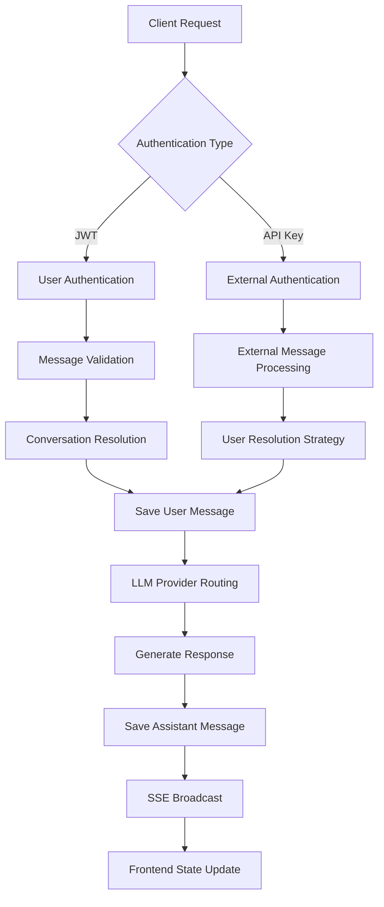

# LibreChat System Architecture: Executive Summary & Implementation Guide

**Date**: June 2025  
**Purpose**: Synthesized analysis and actionable insights for agentic development  
**Related Documents**: 
- `LIBRECHAT_CONVERSATION_FLOW_COMPLETE_ANALYSIS.md`
- `LIBRECHAT_EXTERNAL_MESSAGE_SYSTEM.md`
- `api/server/routes/MESSAGE_FLOW_ARCHITECTURE.md`

---

## System Overview

LibreChat implements a **sophisticated multi-layered conversation system** designed for scalability, real-time communication, and extensive LLM provider integration. The architecture demonstrates advanced patterns in event-driven communication, state synchronization, and external system integration.

### Architecture Strengths

1. **Separation of Concerns**: Clear layered architecture with distinct responsibilities
2. **Real-time Communication**: Robust SSE implementation with client registry management
3. **Provider Agnostic Design**: Dynamic LLM routing supporting 10+ providers
4. **Dual Authentication**: JWT for users, API keys for external systems
5. **State Synchronization**: Frontend Recoil state synchronized with backend data
6. **Extensible Design**: Plugin architecture and middleware system

### Architecture Insights for Agentic Development

#### Key Discovery Points

1. **Existing External Integration**: The system already includes sophisticated external message handling
2. **User Resolution Strategy**: Multi-strategy approach for determining message ownership
3. **Dynamic Provider Routing**: Runtime LLM provider selection and initialization
4. **Conversation Lifecycle Management**: Automated conversation creation and management
5. **Real-time Broadcasting**: SSE-based event system for live updates

---

## Critical Implementation Details

### Data Flow Pattern Analysis



### Key Code Locations for External Message Enhancement

| Component | File Path | Purpose |
|-----------|-----------|---------|
| External Message Routing | `api/server/routes/messages.js:23-30` | Authentication decision logic |
| ExternalClient | `api/server/services/Endpoints/external/` | External message processing |
| User Resolution | `api/models/Conversation.js:100-130` | Multi-strategy user lookup |
| SSE Broadcasting | `api/server/sseClients.js:25-70` | Real-time event distribution |
| State Management | `client/src/store/families.ts:65-120` | Frontend conversation state |
| Authentication | `api/server/middleware/validateExternalMessage.js` | API key validation |

---

## Enhancement Opportunities

### 1. Extended External Integration

**Current State**: Basic external message support with user resolution  
**Enhancement Potential**: 
- Multi-tenant external message routing
- Webhook subscription management
- External message queuing and batch processing
- Custom authentication providers

**Implementation Priority**: High - Builds on existing foundation

### 2. Advanced Real-time Features

**Current State**: SSE for message updates  
**Enhancement Potential**:
- WebSocket upgrade for bidirectional communication
- Message delivery confirmation
- Typing indicators
- Presence awareness

**Implementation Priority**: Medium - Requires significant architecture changes

### 3. Enhanced State Management

**Current State**: Recoil atoms with localStorage persistence  
**Enhancement Potential**:
- Optimistic UI updates with rollback
- Offline message queuing
- Cross-tab synchronization
- Enhanced caching strategies

**Implementation Priority**: Medium - Improves user experience

### 4. Provider Integration Expansion

**Current State**: 10+ LLM providers with dynamic routing  
**Enhancement Potential**:
- Provider failover and load balancing
- Multi-provider response comparison
- Custom provider development framework
- Provider-specific optimization

**Implementation Priority**: Low - System already comprehensive

---

## Architectural Patterns for Agentic Enhancement

### 1. Event-Driven Architecture Extension

```javascript
// Enhanced event system for agentic interactions
class AgenticEventManager extends EventEmitter {
  constructor() {
    super();
    this.agentSubscriptions = new Map();
    this.eventQueue = [];
  }
  
  subscribeAgent(agentId, eventTypes, callback) {
    if (!this.agentSubscriptions.has(agentId)) {
      this.agentSubscriptions.set(agentId, new Map());
    }
    
    eventTypes.forEach(eventType => {
      this.agentSubscriptions.get(agentId).set(eventType, callback);
      this.on(eventType, (data) => {
        if (this.shouldNotifyAgent(agentId, eventType, data)) {
          callback(data);
        }
      });
    });
  }
  
  emitAgenticEvent(eventType, data) {
    // Enhanced event emission with agent filtering
    this.emit(eventType, {
      ...data,
      timestamp: new Date().toISOString(),
      source: 'agentic'
    });
  }
}
```

### 2. Enhanced External Client Pattern

```javascript
// Specialized client for agentic interactions
class AgenticClient extends ExternalClient {
  constructor(options) {
    super(options);
    this.agentId = options.agentId;
    this.capabilities = options.capabilities || [];
    this.subscriptions = new Set();
  }
  
  async initializeAgenticContext() {
    // Initialize agent-specific context
    await this.loadAgentConfiguration();
    await this.subscribeToRelevantEvents();
    await this.initializeToolAccess();
  }
  
  async processAgenticMessage(message) {
    // Enhanced message processing for agents
    const context = await this.buildAgenticContext(message);
    const response = await this.generateContextualResponse(message, context);
    await this.updateAgentMemory(message, response);
    return response;
  }
}
```

### 3. Conversation Context Enhancement

```javascript
// Enhanced conversation context for agentic interactions
class AgenticConversationContext {
  constructor(conversationId) {
    this.conversationId = conversationId;
    this.agentParticipants = new Set();
    this.contextMemory = new Map();
    this.activeTools = new Set();
  }
  
  addAgentParticipant(agentId, capabilities) {
    this.agentParticipants.add({
      agentId,
      capabilities,
      joinedAt: new Date(),
      lastActive: new Date()
    });
  }
  
  updateContext(key, value, agentId) {
    if (!this.contextMemory.has(key)) {
      this.contextMemory.set(key, []);
    }
    
    this.contextMemory.get(key).push({
      value,
      agentId,
      timestamp: new Date()
    });
  }
  
  getContextForAgent(agentId) {
    // Return relevant context for specific agent
    const agentContext = {};
    for (const [key, values] of this.contextMemory) {
      const relevantValues = values.filter(v => 
        v.agentId === agentId || this.isSharedContext(key)
      );
      if (relevantValues.length > 0) {
        agentContext[key] = relevantValues;
      }
    }
    return agentContext;
  }
}
```

---

## Performance and Scalability Insights

### Current Performance Characteristics

1. **Database Operations**: MongoDB with strategic indexing
2. **Memory Usage**: In-memory SSE client registry (scales to ~10k concurrent)
3. **Query Optimization**: React Query caching with strategic invalidation
4. **Search Performance**: MeiliSearch integration for full-text search

### Scaling Bottlenecks and Solutions

| Bottleneck | Current Limit | Solution |
|------------|---------------|----------|
| SSE Connections | ~10k concurrent | Implement SSE clustering with Redis |
| Message Search | Limited by MeiliSearch instance | Implement search sharding |
| Database Queries | MongoDB connection pool | Implement read replicas |
| File Storage | Local filesystem | Migrate to object storage (S3) |

### Performance Optimization Recommendations

1. **Database Layer**:
   - Implement connection pooling optimization
   - Add query result caching with Redis
   - Optimize indexes for conversation retrieval patterns

2. **Real-time Layer**:
   - Implement SSE connection clustering
   - Add message delivery confirmation
   - Optimize broadcast filtering

3. **Frontend Layer**:
   - Implement virtual scrolling for large conversations
   - Add service worker for offline support
   - Optimize bundle splitting for faster initial load

---

## Security Architecture Analysis

### Current Security Model

1. **Authentication**: JWT for users, API keys for external systems
2. **Authorization**: User-based conversation ownership
3. **Data Validation**: Mongoose schema validation
4. **Rate Limiting**: Basic implementation for external messages

### Security Enhancement Opportunities

1. **Enhanced External Authentication**:
   ```javascript
   // Multi-level API key permissions
   const API_KEY_ROLES = {
     'agent-key': {
       permissions: ['message:create', 'conversation:read'],
       rateLimit: { requests: 1000, window: 3600 },
       allowedEndpoints: ['openai', 'anthropic']
     },
     'system-key': {
       permissions: ['*'],
       rateLimit: { requests: 10000, window: 3600 },
       allowedEndpoints: ['*']
     }
   };
   ```

2. **Content Security**:
   - Message content sanitization
   - File upload validation
   - External URL validation for safety

3. **Audit Trail**:
   - Enhanced logging for external messages
   - User action tracking
   - Security event monitoring

---

## Implementation Roadmap for Agentic Enhancement

### Phase 1: Foundation Enhancement (Weeks 1-2)
- [ ] Extend external message validation
- [ ] Implement enhanced user resolution strategies
- [ ] Add agentic-specific logging and monitoring
- [ ] Create agentic message testing framework

### Phase 2: Core Agentic Features (Weeks 3-6)
- [ ] Implement AgenticClient class with enhanced capabilities
- [ ] Add agent subscription and event management
- [ ] Implement conversation context enhancement
- [ ] Add multi-agent coordination primitives

### Phase 3: Advanced Features (Weeks 7-10)
- [ ] Implement agent memory and context persistence
- [ ] Add advanced real-time coordination features
- [ ] Implement agent-specific UI components
- [ ] Add comprehensive agentic analytics

### Phase 4: Optimization and Scaling (Weeks 11-12)
- [ ] Performance optimization for multi-agent scenarios
- [ ] Implement advanced caching strategies
- [ ] Add comprehensive monitoring and alerting
- [ ] Production deployment and testing

---

## Code Quality and Maintainability Assessment

### Strengths
- **Consistent Patterns**: Clear architectural patterns throughout codebase
- **Error Handling**: Comprehensive error handling with logging
- **Type Safety**: TypeScript usage in frontend with proper typing
- **Documentation**: Existing comprehensive documentation
- **Testing**: Test files present for critical components

### Areas for Improvement
- **Code Comments**: Some complex logic could benefit from more inline documentation
- **Type Coverage**: Backend could benefit from TypeScript migration
- **Testing Coverage**: Expand unit test coverage for external message flows
- **Performance Monitoring**: Add more granular performance metrics

---

## Conclusion

LibreChat demonstrates a mature, well-architected conversation system with strong foundations for agentic enhancement. The existing external message system, combined with the robust state management and real-time communication architecture, provides an excellent foundation for building sophisticated multi-agent interactions.

The key insight for agentic development is that **most of the architectural foundations already exist**. The external message system, user resolution strategies, dynamic provider routing, and real-time communication infrastructure can be leveraged and extended rather than rebuilt.

### Recommended Next Steps

1. **Study the External Message System**: Deep dive into `api/server/services/Endpoints/external/` to understand existing patterns
2. **Implement Enhanced Validation**: Extend message validation for agentic use cases
3. **Build Agentic Client**: Create specialized client building on ExternalClient foundation
4. **Enhance Real-time Features**: Extend SSE system for agent coordination
5. **Implement Context Management**: Build conversation context system for multi-agent interactions

The system's architecture strongly supports extensibility and the addition of agentic capabilities without requiring fundamental changes to the core conversation flow. 