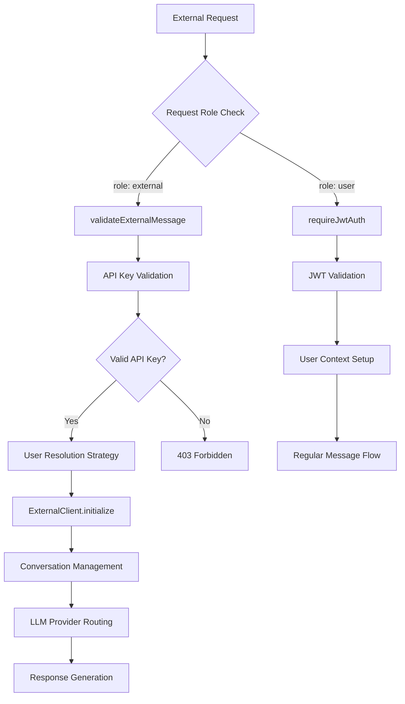
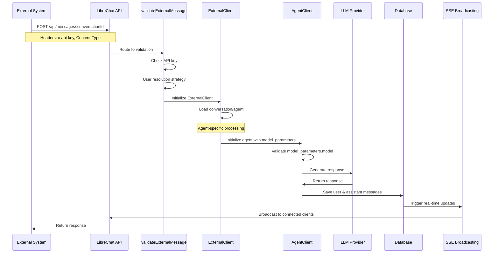
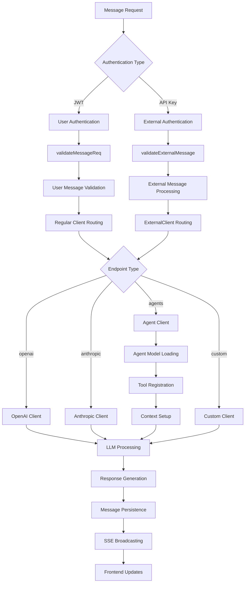

# LibreChat System Architecture: Executive Summary & Implementation Guide

**Date**: June 2025  
**Purpose**: Synthesized analysis and actionable insights for agentic development  
**Related Documents**: 
- `LIBRECHAT_CONVERSATION_FLOW_COMPLETE_ANALYSIS.md`
- `LIBRECHAT_EXTERNAL_MESSAGE_SYSTEM.md`
- `api/server/routes/MESSAGE_FLOW_ARCHITECTURE.md`
- `api/MCP_DOCUMENTATION.md`

---

## System Overview

LibreChat implements a **sophisticated multi-layered conversation system** designed for scalability, real-time communication, and extensive LLM provider integration. The architecture demonstrates advanced patterns in event-driven communication, state synchronization, external system integration, and advanced agent-based workflows.

### Architecture Strengths

1. **Separation of Concerns**: Clear layered architecture with distinct responsibilities
2. **Real-time Communication**: Robust SSE implementation with client registry management
3. **Provider Agnostic Design**: Dynamic LLM routing supporting 10+ providers
4. **Dual Authentication**: JWT for users, API keys for external systems
5. **State Synchronization**: Frontend Recoil state synchronized with backend data
6. **Extensible Design**: Plugin architecture and middleware system
7. **Advanced Agent Support**: Comprehensive agent endpoint with tool integration
8. **External Message Processing**: Dedicated pathway for automated systems and integrations

### Architecture Insights for Agentic Development

#### Key Discovery Points

1. **Existing External Integration**: The system already includes sophisticated external message handling
2. **User Resolution Strategy**: Multi-strategy approach for determining message ownership
3. **Dynamic Provider Routing**: Runtime LLM provider selection and initialization
4. **Conversation Lifecycle Management**: Automated conversation creation and management
5. **Real-time Broadcasting**: SSE-based event system for live updates

---

## Critical External Message Architecture

### External Endpoint System Overview

The external message system provides a dedicated pathway for non-user entities (bots, webhooks, APIs, automated systems, agents) to interact with conversations. This system operates parallel to the regular user message flow while maintaining conversation integrity and user ownership.

#### Authentication Flow Diagram



#### Key External Message Components

| Component | File Path | Purpose | Critical Issues |
|-----------|-----------|---------|-----------------|
| **Authentication Router** | `api/server/routes/messages.js:23-30` | Routes external vs user messages | ✅ Working |
| **External Validation** | `api/server/middleware/validateExternalMessage.js` | API key validation, user resolution | ⚠️ Phone number edge cases |
| **ExternalClient** | `api/server/services/Endpoints/external/index.js` | Core external message processing | ⚠️ Agent model parameter issues |
| **Agent Integration** | `api/server/services/Endpoints/agents/agent.js` | Agent-specific external handling | 🔧 Recently fixed model_parameters |
| **User Resolution** | Multiple files | Multi-strategy user lookup | ✅ Working |

### Recent Critical Fixes (June 2024)

#### 1. Agent External Message Model Parameter Issue

**Problem**: External messages to agents caused `Cannot read properties of undefined (reading 'match')` error.

**Root Cause**: When agents are loaded for external messages, the `initializeAgent` function in `agents/agent.js` was overwriting `agent.model_parameters` without preserving the `model` field set by external client.

**Fix Location**: `api/server/services/Endpoints/agents/agent.js:166-175`

```javascript
// BUGFIX: Preserve model field set by external client for external messages
// Ensure model is set from modelOptions or existing model
if (!agent.model_parameters.model) {
  agent.model_parameters.model = modelOptions.model || existingModel || agent.model;
}
```

**Solution Strategy**: Preserve existing `model_parameters.model` field when `initializeAgent` reconstructs the model parameters object.

#### 2. External Client Agent Loading Enhancement

**Enhancement Location**: `api/server/services/Endpoints/external/index.js:517-535`

```javascript
// BUGFIX: Ensure agent has proper model_parameters.model for external messages
if (!agent.model_parameters) {
  agent.model_parameters = {};
}
if (!agent.model_parameters.model) {
  const modelToUse = message.metadata?.model || agent.model || this.model || 'gpt-4o';
  agent.model_parameters.model = modelToUse;
}
```

**Purpose**: Add defensive checks in external client to ensure agents have proper model configuration before passing to internal agent clients.

### External Message Flow Architecture

#### Complete Flow Diagram



#### User Resolution Strategy

The external message system uses a multi-strategy approach to determine message ownership:

```javascript
// Priority order for user resolution
async resolveUser() {
  // Strategy 1: Direct user from options
  if (this.options.user) return this.options.user;
  
  // Strategy 2: Conversation owner lookup
  if (this.options.conversationId) {
    const conversation = await getConvo(null, this.options.conversationId);
    if (conversation?.user) return conversation.user;
  }
  
  // Strategy 3: JWT token recovery
  const token = this.extractJwtToken();
  if (token) {
    const payload = jwt.verify(token, process.env.JWT_SECRET);
    if (payload?.id) return payload.id;
  }
  
  // Strategy 4: Request user context
  if (this.req.user) return this.req.user.id;
  
  // Strategy 5: API key to user mapping
  const user = await this.getUserByApiKey(this.apiKey);
  if (user) return user.id;
}
```

### Environment Configuration

Required environment variables for external message system:

```bash
# Core external message authentication
EXTERNAL_MESSAGE_API_KEY=your-secure-api-key-here

# JWT secret for token validation
JWT_SECRET=your-jwt-secret

# MongoDB connection for data persistence
MONGODB_URI=mongodb://localhost:27017/librechat

# Optional: Multiple API keys support
EXTERNAL_API_KEYS=key1,key2,key3
```

---

## Agent Architecture Integration

### Agent Endpoint Overview

The agent endpoint (`/api/agents/*`) provides sophisticated AI agent capabilities with tool integration, memory management, and external message support.

#### Agent Components

| Component | File Path | Purpose |
|-----------|-----------|---------|
| **Agent Model** | `api/models/Agent.js` | Agent data persistence and loading |
| **Agent Controller** | `api/server/controllers/agents/client.js` | Agent conversation handling |
| **Agent Service** | `api/server/services/Endpoints/agents/agent.js` | Agent initialization and setup |
| **Agent Routes** | `api/server/routes/agents/v1.js` | RESTful agent management |

#### Agent External Message Integration

**Critical Path**: External Message → ExternalClient → Agent Loading → Agent Initialization → Agent Client

```javascript
// Agent loading in external context (api/server/services/Endpoints/external/index.js)
if (correctEndpointType === 'agents') {
  const agent = await loadAgent({
    req: this.req,
    agent_id: this.options.agent_id,
    endpoint: correctEndpointType,
    model_parameters: this.options.model_parameters
  });
  
  // Ensure proper model configuration for external messages
  if (!agent.model_parameters?.model) {
    agent.model_parameters = agent.model_parameters || {};
    agent.model_parameters.model = message.metadata?.model || agent.model || 'gpt-4o';
  }
}
```

#### Agent Tool Integration

Agents support multiple tool types:
- **Built-in Tools**: Code execution, web search
- **MCP Tools**: Model Context Protocol integrations
- **Custom Tools**: User-defined functionality

**MCP Integration**: Agents can access MCP servers for enhanced capabilities:

```javascript
// MCP tool registration in agents
const mcpServers = new Set(ephemeralAgent?.mcp);
if (mcpServers.size > 0) {
  for (const toolName of Object.keys(availableTools)) {
    if (toolName.includes(mcp_delimiter)) {
      const mcpServer = toolName.split(mcp_delimiter)?.[1];
      if (mcpServers.has(mcpServer)) {
        tools.push(toolName);
      }
    }
  }
}
```

---

## Enhanced Data Flow Pattern Analysis

### Complete Message Processing Flow



### Error Handling Patterns

#### External Message Error Handling

```javascript
// Enhanced error handling for external messages
try {
  const result = await this.processExternalMessage(message);
  return result;
} catch (error) {
  // Log context for debugging
  logger.error('[ExternalClient] Processing failed:', {
    messageId: message.messageId,
    conversationId: message.conversationId,
    endpoint: this.options.endpoint,
    agentId: this.options.agent_id,
    error: error.message,
    stack: process.env.NODE_ENV === 'development' ? error.stack : undefined
  });
  
  // Return user-friendly error
  throw new Error(`External message processing failed: ${error.message}`);
}
```

#### Agent-Specific Error Handling

```javascript
// Agent model parameter validation
if (!agent.model_parameters?.model) {
  logger.warn('[AgentClient] Missing model parameters for agent:', {
    agentId: agent.id,
    hasModelParams: !!agent.model_parameters,
    agentModel: agent.model
  });
  
  // Apply defensive fix
  agent.model_parameters = agent.model_parameters || {};
  agent.model_parameters.model = agent.model || 'gpt-4o';
}
```

---

## Performance and Scalability Insights

### Current Performance Characteristics

1. **Database Operations**: MongoDB with strategic indexing
2. **Memory Usage**: In-memory SSE client registry (scales to ~10k concurrent)
3. **Query Optimization**: React Query caching with strategic invalidation
4. **Search Performance**: MeiliSearch integration for full-text search
5. **Agent Processing**: Optimized agent loading and tool registration

### Scaling Bottlenecks and Solutions

| Bottleneck | Current Limit | Solution | Priority |
|------------|---------------|----------|----------|
| SSE Connections | ~10k concurrent | Redis-based clustering | High |
| Agent Model Loading | Per-request loading | Agent caching layer | Medium |
| External Message Rate Limiting | Basic implementation | Advanced rate limiting with Redis | High |
| MCP Tool Discovery | Runtime discovery | Tool caching and preloading | Medium |
| Database Queries | MongoDB connection pool | Read replicas + connection optimization | High |

### External Message Performance Optimization

```javascript
// Caching strategy for external messages
class ExternalMessageCache {
  constructor() {
    this.userCache = new Map();
    this.conversationCache = new Map();
    this.agentCache = new Map();
  }
  
  async getCachedUser(phoneNumber) {
    if (this.userCache.has(phoneNumber)) {
      return this.userCache.get(phoneNumber);
    }
    
    const user = await findUserByPhoneNumber(phoneNumber);
    this.userCache.set(phoneNumber, user);
    return user;
  }
  
  async getCachedAgent(agentId) {
    if (this.agentCache.has(agentId)) {
      return this.agentCache.get(agentId);
    }
    
    const agent = await loadAgent({ agent_id: agentId });
    this.agentCache.set(agentId, agent);
    return agent;
  }
}
```

---

## Security Architecture Analysis

### Enhanced Security Model

1. **Authentication**: JWT for users, API keys for external systems
2. **Authorization**: User-based conversation ownership + agent access control
3. **Data Validation**: Mongoose schema validation + external message validation
4. **Rate Limiting**: API key-based rate limiting for external systems
5. **Audit Trail**: Comprehensive logging for external message processing

### External Message Security

```javascript
// Enhanced API key validation with permissions
const API_KEY_PERMISSIONS = {
  'agent-automation-key': {
    allowedEndpoints: ['agents'],
    rateLimit: { requests: 1000, window: 3600 },
    allowedConversations: ['agent-*'], // Pattern matching
    requiredMetadata: ['agent_id', 'source']
  },
  'sms-gateway-key': {
    allowedEndpoints: ['openai', 'anthropic'],
    rateLimit: { requests: 500, window: 3600 },
    allowedConversations: ['sms-*'],
    requiredMetadata: ['phoneNumber', 'source']
  }
};

function validateExternalMessagePermissions(apiKey, request) {
  const permissions = API_KEY_PERMISSIONS[apiKey];
  
  // Check endpoint access
  if (!permissions.allowedEndpoints.includes(request.metadata.endpoint)) {
    throw new Error(`Endpoint '${request.metadata.endpoint}' not allowed for this API key`);
  }
  
  // Check required metadata
  for (const field of permissions.requiredMetadata) {
    if (!request.metadata[field]) {
      throw new Error(`Required metadata field '${field}' missing`);
    }
  }
  
  // Rate limiting per API key
  return checkRateLimit(apiKey, permissions.rateLimit);
}
```

---

## Implementation Roadmap for External Message Enhancement

### Phase 1: Foundation Hardening (Weeks 1-2)
- [x] ✅ Fix agent external message model parameter issue
- [x] ✅ Enhance external client agent loading
- [ ] 🔧 Implement comprehensive external message testing
- [ ] 📝 Add external message monitoring and alerting
- [ ] 🔐 Enhance API key permission system

### Phase 2: Advanced External Features (Weeks 3-6)
- [ ] 🚀 Implement external message caching layer
- [ ] 📊 Add external message analytics and metrics
- [ ] 🔄 Implement external message retry and error recovery
- [ ] 🌐 Add webhook support for external message callbacks
- [ ] 💬 Implement external message conversation threading

### Phase 3: Agent-External Integration (Weeks 7-10)
- [ ] 🤖 Implement agent memory persistence for external messages
- [ ] 🔧 Add agent-specific external message validation
- [ ] 📋 Implement agent task scheduling and automation
- [ ] 🔗 Add cross-agent communication via external messages
- [ ] 📈 Implement agent performance monitoring for external interactions

### Phase 4: Production Optimization (Weeks 11-12)
- [ ] ⚡ Optimize external message processing performance
- [ ] 📊 Implement comprehensive monitoring dashboard
- [ ] 🛡️ Security audit and penetration testing
- [ ] 📚 Complete documentation and training materials

---

## Debugging Guide for External Messages

### Common Issues and Solutions

#### 1. Agent Model Parameter Undefined Error

**Error**: `Cannot read properties of undefined (reading 'match')`

**Cause**: Agent `model_parameters.model` not properly set during external message processing

**Debug Steps**:
```javascript
// Add debug logging in api/server/controllers/agents/client.js
logger.debug('[AgentClient] Agent structure debug:', {
  agent_id: agent.id,
  has_model_parameters: !!agent.model_parameters,
  model_parameters: agent.model_parameters,
  agent_model: agent.model
});
```

**Solution**: Ensure model parameter preservation in `agents/agent.js` initialization

#### 2. External Message Authentication Failures

**Error**: `Invalid API key` or `API key required`

**Debug Steps**:
```javascript
// Check environment variables
console.log('EXTERNAL_MESSAGE_API_KEY:', process.env.EXTERNAL_MESSAGE_API_KEY ? 'Set' : 'Not Set');

// Check request headers
logger.debug('[validateExternalMessage] Request headers:', {
  'x-api-key': req.headers['x-api-key'] ? 'Present' : 'Missing',
  'content-type': req.headers['content-type'],
  'authorization': req.headers['authorization'] ? 'Present' : 'Missing'
});
```

#### 3. User Resolution Failures

**Error**: `User not authenticated` in external messages

**Debug Steps**:
```javascript
// Add comprehensive user resolution logging
logger.debug('[ExternalClient] User resolution debug:', {
  'options.user': this.options.user,
  'conversationId': this.options.conversationId,
  'req.user': this.req.user?.id,
  'conversation.user': conversation?.user
});
```

### Monitoring and Alerting

```javascript
// External message monitoring setup
const externalMessageMetrics = {
  totalRequests: 0,
  successfulRequests: 0,
  failedRequests: 0,
  averageProcessingTime: 0,
  errorsByType: new Map()
};

function recordExternalMessageMetric(type, processingTime, error = null) {
  externalMessageMetrics.totalRequests++;
  
  if (error) {
    externalMessageMetrics.failedRequests++;
    const errorType = error.constructor.name;
    externalMessageMetrics.errorsByType.set(
      errorType,
      (externalMessageMetrics.errorsByType.get(errorType) || 0) + 1
    );
  } else {
    externalMessageMetrics.successfulRequests++;
  }
  
  // Update average processing time
  externalMessageMetrics.averageProcessingTime = 
    (externalMessageMetrics.averageProcessingTime + processingTime) / 2;
}
```

---

## Conclusion

LibreChat's external message system demonstrates a mature, well-architected approach to external system integration with strong foundations for advanced automation and agent-based workflows. The recent fixes to agent external message processing highlight the importance of careful model parameter management and defensive programming practices.

### Key Insights for Future Development

1. **Model Parameter Management**: Always preserve existing configurations when initializing agents from external contexts
2. **Defensive Programming**: Add comprehensive validation and fallback logic for external message processing
3. **Comprehensive Testing**: External message flows require dedicated testing frameworks due to their complexity
4. **Monitoring Requirements**: External systems need enhanced monitoring due to their automated nature
5. **Security Considerations**: API key management and rate limiting are critical for production deployments

### Recommended Next Steps

1. **Implement Comprehensive Testing**: Build automated test suites specifically for external message flows
2. **Enhanced Monitoring**: Deploy monitoring and alerting for external message processing
3. **Performance Optimization**: Implement caching layers for frequently accessed data in external flows
4. **Documentation**: Maintain up-to-date documentation reflecting architectural changes and debugging insights
5. **Security Hardening**: Regular security audits of external message authentication and authorization

The system's architecture strongly supports extensibility and the addition of advanced external integrations without requiring fundamental changes to the core conversation flow. The recent debugging work provides valuable insights for maintaining and enhancing the external message system as LibreChat continues to evolve. 