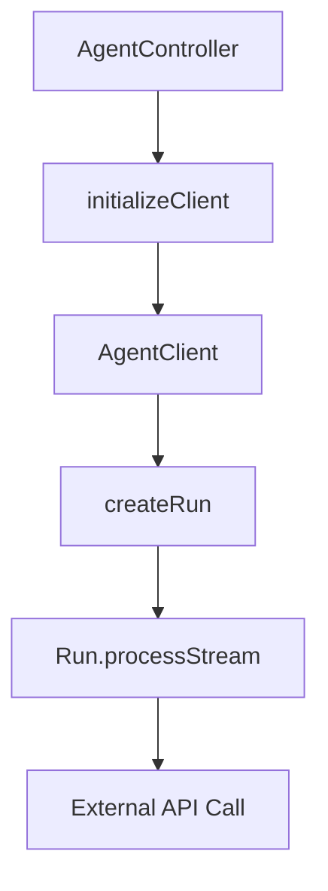

# Agent Request Trace in LibreChat

## Overview
This document traces the flow of agent requests in LibreChat, from initial user interaction to the final API call.

## Request Flow

## Component Details

### 1. AgentController
- Entry point for agent requests
- Located in `api/server/controllers/agents/request.js`
- Handles initial request setup and client initialization

### 2. Client Initialization
- Creates an instance of `AgentClient`
- Configures client with necessary options
- Sets up streaming and event handling

### 3. AgentClient
- Main client class for agent interactions
- Extends `BaseClient`
- Manages agent-specific functionality
- Handles token counting and conversation management

### 4. Run Creation
- Uses `@librechat/agents` package
- Creates a `Run` instance for managing the execution
- Configures:
  - Model parameters
  - Custom handlers
  - Streaming settings
  - Abort signal

### 5. Stream Processing
- Handled by `Run.processStream`
- Makes the actual API call to the provider
- Manages streaming responses
- Handles tool calls and responses

## Key Components

### StreamRunManager
- Manages streaming events
- Handles content updates
- Processes tool calls
- Manages file attachments

### Run Class
- Core execution management
- Handles API communication
- Manages state and progress
- Processes streaming events

## Current Limitations

1. **Request Visibility**
   - Actual API request is made within `@librechat/agents`
   - Not directly visible in LibreChat codebase
   - Abstracted by external package

2. **Logging Challenges**
   - Cannot directly intercept request without package modification
   - Request details are encapsulated
   - Provider-specific details are handled internally

## Potential Solutions for Request Logging

1. **Package Modification**
   - Add logging in `@librechat/agents`
   - Modify `Run.processStream` to include request logging
   - Add provider-specific logging

2. **Network Monitoring**
   - Use proxy to intercept requests
   - Implement network monitoring tools
   - Capture HTTP traffic

3. **Middleware Approach**
   - Add logging middleware
   - Intercept requests before they reach the package
   - Log request details and configuration

## Future Improvements

1. **Enhanced Visibility**
   - Add request logging capabilities
   - Improve debugging tools
   - Better error tracking

2. **Documentation**
   - Document request flow
   - Add provider-specific details
   - Include troubleshooting guides

3. **Development Tools**
   - Add request inspection tools
   - Improve debugging capabilities
   - Better error reporting 