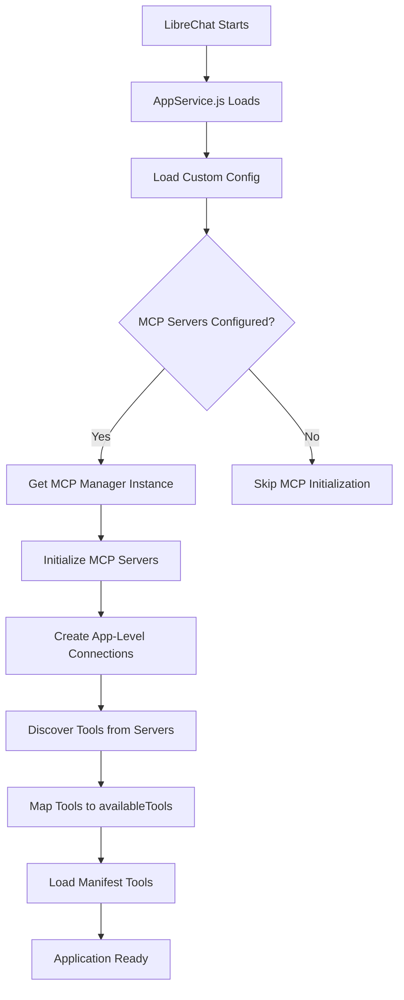
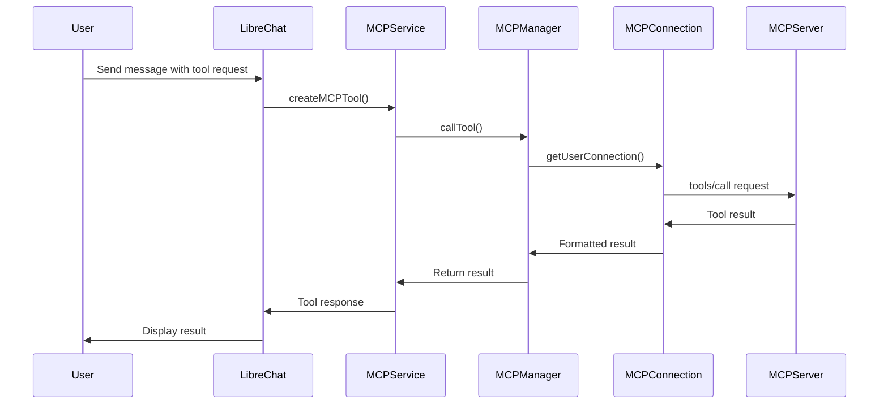

# LibreChat MCP (Model Context Protocol) Architecture Documentation

## Overview

This document provides a comprehensive trace of how data and messages are constructed, processed, and sent to MCP servers in LibreChat. The MCP integration allows LibreChat to dynamically connect to external MCP servers and utilize their tools seamlessly within conversations.

## Table of Contents

1. [Architecture Overview](#architecture-overview)
2. [Core Components](#core-components)
3. [Data Flow](#data-flow)
4. [Message Construction](#message-construction)
5. [Tool Registration Process](#tool-registration-process)
6. [Tool Execution Flow](#tool-execution-flow)
7. [Data Structures](#data-structures)
8. [Configuration](#configuration)
9. [Error Handling](#error-handling)
10. [Code Examples](#code-examples)

## Architecture Overview

LibreChat's MCP integration follows a layered architecture:

```
┌─────────────────────────────────────────────────────────────┐
│                    LibreChat Frontend                       │
├─────────────────────────────────────────────────────────────┤
│                    Express API Layer                        │
├─────────────────────────────────────────────────────────────┤
│               MCP Service Layer (MCP.js)                    │
├─────────────────────────────────────────────────────────────┤
│             MCP Manager (librechat-mcp package)             │
├─────────────────────────────────────────────────────────────┤
│                MCP Connections Layer                        │
├─────────────────────────────────────────────────────────────┤
│              Transport Layer (stdio/ws/sse/http)            │
├─────────────────────────────────────────────────────────────┤
│                     MCP Servers                             │
└─────────────────────────────────────────────────────────────┘
```

## Core Components

### 1. MCPManager (`packages/mcp/src/manager.ts`)

The `MCPManager` is a singleton that manages all MCP server connections and serves as the central orchestrator for MCP operations.

**Key Responsibilities:**
- Initializes and maintains connections to MCP servers
- Manages both app-level and user-specific connections
- Handles tool discovery and registration
- Coordinates tool execution calls
- Manages connection lifecycle and cleanup

**Critical Code:**
```typescript:packages/mcp/src/manager.ts
export class MCPManager {
  private static instance: MCPManager | null = null;
  /** App-level connections initialized at startup */
  private connections: Map<string, MCPConnection> = new Map();
  /** User-specific connections initialized on demand */
  private userConnections: Map<string, Map<string, MCPConnection>> = new Map();
  
  public static getInstance(logger?: Logger): MCPManager {
    if (!MCPManager.instance) {
      MCPManager.instance = new MCPManager(logger);
    }
    return MCPManager.instance;
  }
}
```

### 2. MCPConnection (`packages/mcp/src/connection.ts`)

Each `MCPConnection` represents a connection to a single MCP server, handling transport-level communication.

**Key Responsibilities:**
- Manages transport connections (stdio, WebSocket, SSE, HTTP)
- Handles connection state and reconnection logic
- Provides methods for tool discovery and execution
- Manages connection lifecycle events

**Transport Types Supported:**
- **stdio**: Command-line process communication
- **WebSocket**: Real-time bidirectional communication
- **SSE**: Server-sent events for HTTP streaming
- **Streamable HTTP**: HTTP POST with streaming responses

### 3. MCP Service Layer (`api/server/services/MCP.js`)

The service layer bridges LibreChat's tool system with the MCP infrastructure.

**Key Function:**
```javascript:api/server/services/MCP.js
async function createMCPTool({ req, toolKey, provider: _provider }) {
  const toolDefinition = req.app.locals.availableTools[toolKey]?.function;
  const [toolName, serverName] = toolKey.split(Constants.mcp_delimiter);
  
  const _call = async (toolArguments, config) => {
    const mcpManager = getMCPManager(config?.configurable?.user_id);
    const result = await mcpManager.callTool({
      serverName,
      toolName,
      provider,
      toolArguments,
      options: {
        userId: config?.configurable?.user_id,
        signal: derivedSignal,
      },
    });
    return result;
  };
  
  return tool(_call, { schema, name: normalizedToolKey, description });
}
```

## Data Flow

### 1. Application Startup Flow



**Startup Code Trace:**
```javascript:api/server/services/AppService.js
const AppService = async (app) => {
  // Load configuration
  const config = (await loadCustomConfig()) ?? {};
  
  // Load standard tools
  const availableTools = loadAndFormatTools({
    adminFilter: filteredTools,
    adminIncluded: includedTools,
    directory: paths.structuredTools,
  });

  // Initialize MCP if configured
  if (config.mcpServers != null) {
    const mcpManager = getMCPManager();
    await mcpManager.initializeMCP(config.mcpServers, processMCPEnv);
    await mcpManager.mapAvailableTools(availableTools); // Adds MCP tools
  }
  
  app.locals = { ...defaultLocals, availableTools, ... };
};
```

### 2. Tool Discovery Flow

When MCP servers are initialized, LibreChat discovers their tools:

```javascript:packages/mcp/src/manager.ts
public async mapAvailableTools(availableTools: t.LCAvailableTools): Promise<void> {
  for (const [serverName, connection] of this.connections.entries()) {
    const tools = await connection.fetchTools(); // Calls tools/list on MCP server
    for (const tool of tools) {
      const name = `${tool.name}${CONSTANTS.mcp_delimiter}${serverName}`;
      availableTools[name] = {
        type: 'function',
        ['function']: {
          name,
          description: tool.description,
          parameters: tool.inputSchema as JsonSchemaType,
        },
      };
    }
  }
}
```

### 3. Tool Execution Flow



## Message Construction

### 1. Tool Call Message Structure

When LibreChat calls an MCP tool, it constructs a JSON-RPC message:

```typescript
// MCP Protocol Message Structure
{
  "jsonrpc": "2.0",
  "id": "unique-request-id",
  "method": "tools/call",
  "params": {
    "name": "tool_name",
    "arguments": {
      // Tool-specific arguments as defined by the tool's JSON schema
      "param1": "value1",
      "param2": "value2"
    }
  }
}
```

**Code Location:**
```typescript:packages/mcp/src/manager.ts
const result = await connection.client.request(
  {
    method: 'tools/call',
    params: {
      name: toolName,
      arguments: toolArguments,
    },
  },
  CallToolResultSchema,
  {
    timeout: connection.timeout,
    ...callOptions,
  },
);
```

### 2. Tool Discovery Message

For tool discovery, LibreChat sends:

```typescript
{
  "jsonrpc": "2.0",
  "id": "discovery-request-id",
  "method": "tools/list",
  "params": {}
}
```

**Server Response:**
```typescript
{
  "jsonrpc": "2.0",
  "id": "discovery-request-id",
  "result": {
    "tools": [
      {
        "name": "tool_name",
        "description": "Tool description",
        "inputSchema": {
          "type": "object",
          "properties": {
            // JSON Schema for tool parameters
          }
        }
      }
    ]
  }
}
```

## Tool Registration Process

### 1. App-Level Registration

During startup, tools are registered globally:

```javascript:api/server/services/AppService.js
// 1. Initialize MCP connections
await mcpManager.initializeMCP(config.mcpServers, processMCPEnv);

// 2. Discover and map MCP tools to availableTools
await mcpManager.mapAvailableTools(availableTools);

// 3. Store in app.locals for global access
app.locals.availableTools = availableTools;
```

### 2. Tool Key Format

MCP tools are identified using a specific naming convention:
```
Format: {toolName}__LIBRECHAT_MCP_DELIMITER__{serverName}
Example: "create_task__LIBRECHAT_MCP_DELIMITER__scheduled-tasks"
```

**Pattern Recognition:**
```javascript:api/app/clients/tools/util/handleTools.js
const mcpToolPattern = new RegExp(`^.+${Constants.mcp_delimiter}.+$`);

// Tool loading logic
if (tool && appTools[tool] && mcpToolPattern.test(tool)) {
  requestedTools[tool] = async () =>
    createMCPTool({
      req: options.req,
      toolKey: tool,
      model: agent?.model ?? model,
      provider: agent?.provider ?? endpoint,
    });
}
```

## Tool Execution Flow

### 1. LangChain Tool Creation

MCP tools are wrapped as LangChain tools:

```javascript:api/server/services/MCP.js
const toolInstance = tool(_call, {
  schema,
  name: normalizedToolKey,
  description: description || '',
  responseFormat: AgentConstants.CONTENT_AND_ARTIFACT,
});
toolInstance.mcp = true; // Mark as MCP tool
```

### 2. Connection Management

LibreChat manages two types of connections:

**App-Level Connections:**
- Initialized at startup
- Shared across all users
- Used for tool discovery
- Persistent throughout application lifecycle

**User-Specific Connections:**
- Created on-demand per user
- Isolated per user session
- Support user-specific configurations
- Auto-cleanup after idle timeout (15 minutes)

```typescript:packages/mcp/src/manager.ts
async callTool({ serverName, toolName, provider, toolArguments, options }) {
  const { userId, ...callOptions } = options ?? {};
  
  if (userId) {
    // Get or create user-specific connection
    connection = await this.getUserConnection(userId, serverName);
  } else {
    // Use app-level connection
    connection = this.connections.get(serverName);
  }
  
  const result = await connection.client.request({
    method: 'tools/call',
    params: { name: toolName, arguments: toolArguments },
  });
  
  return formatToolContent(result, provider);
}
```

## Data Structures

### 1. Tool Definition Structure

```typescript:packages/mcp/src/types/mcp.ts
export interface LCTool {
  name: string;
  description?: string;
  parameters: JsonSchemaType; // JSON Schema defining tool parameters
}

export interface LCFunctionTool {
  type: 'function';
  ['function']: LCTool;
}

export type LCAvailableTools = Record<string, LCFunctionTool>;
```

### 2. MCP Tool Response Structure

```typescript:packages/mcp/src/types/mcp.ts
export type MCPToolCallResponse = {
  _meta?: Record<string, unknown>;
  content?: Array<ToolContentPart>;
  isError?: boolean;
};

export type ToolContentPart = 
  | { type: 'text'; text: string }
  | { type: 'image'; data: string; mimeType: string }
  | { type: 'resource'; resource: MCPResource }
  | { type: 'audio'; data: string; mimeType: string };
```

### 3. Connection State Management

```typescript:packages/mcp/src/types/mcp.ts
export type ConnectionState = 'disconnected' | 'connecting' | 'connected' | 'error';
```

## Configuration

### 1. LibreChat Configuration

MCP servers are configured in the LibreChat configuration file:

```yaml
# librechat.yaml
mcpServers:
  scheduled-tasks:
    command: "node"
    args: ["dist/index.js"]
    env:
      NODE_ENV: "production"
    iconPath: "/path/to/icon.png"
    timeout: 30000
    
  weather-server:
    url: "http://localhost:3001/mcp"
    type: "sse"
    headers:
      Authorization: "Bearer token"
```

### 2. Environment Processing

The `processMCPEnv` function processes environment variables:

```javascript
// Supports variable substitution like ${API_KEY}
const config = this.processMCPEnv ? this.processMCPEnv(_config, userId) : _config;
```

## Error Handling

### 1. Connection Errors

```typescript:packages/mcp/src/connection.ts
private async handleReconnection(): Promise<void> {
  const backoffDelay = (attempt: number) => Math.min(1000 * Math.pow(2, attempt), 30000);
  
  while (this.reconnectAttempts < this.MAX_RECONNECT_ATTEMPTS) {
    this.reconnectAttempts++;
    const delay = backoffDelay(this.reconnectAttempts);
    await new Promise((resolve) => setTimeout(resolve, delay));
    
    try {
      await this.connect();
      return; // Success
    } catch (error) {
      this.logger?.error(`Reconnection attempt failed:`, error);
    }
  }
}
```

### 2. Tool Execution Errors

```javascript:api/server/services/MCP.js
const _call = async (toolArguments, config) => {
  try {
    const result = await mcpManager.callTool({
      serverName, toolName, provider, toolArguments, options
    });
    return result;
  } catch (error) {
    logger.error(`[MCP][${serverName}] Error calling "${toolName}":`, error);
    throw new Error(`"${toolKey}" tool call failed: ${error?.message}`);
  }
};
```

## Response Formatting

### 1. Content Parsing

The `formatToolContent` function processes MCP responses for different providers:

```typescript:packages/mcp/src/parsers.ts
export function formatToolContent(
  result: MCPToolCallResponse,
  provider: Provider,
): FormattedContentResult {
  const content = result?.content ?? [];
  const formattedContent: FormattedContent[] = [];
  const imageUrls: FormattedContent[] = [];
  
  // Process different content types
  for (const item of content) {
    if (item.type === 'text') {
      formattedContent.push({ type: 'text', text: item.text });
    } else if (item.type === 'image') {
      const formattedImage = formatImage(item);
      if (formattedImage.type === 'image_url') {
        imageUrls.push(formattedImage);
      } else {
        formattedContent.push(formattedImage);
      }
    }
    // Handle resource, audio, etc.
  }
  
  return [formattedContent, imageUrls.length ? { content: imageUrls } : undefined];
}
```

## Code Examples

### 1. Complete MCP Server Implementation Example

```typescript
// Example MCP Server (based on scheduled-tasks server)
import { Server } from '@modelcontextprotocol/sdk/server/index.js';
import { StdioServerTransport } from '@modelcontextprotocol/sdk/server/stdio.js';
import { CallToolRequestSchema, ListToolsRequestSchema } from '@modelcontextprotocol/sdk/types.js';

const server = new Server({
  name: "example-server",
  version: "1.0.0",
}, {
  capabilities: { tools: {} },
});

// Handle tool listing
server.setRequestHandler(ListToolsRequestSchema, async () => {
  return {
    tools: [
      {
        name: 'example_tool',
        description: 'An example tool',
        inputSchema: {
          type: 'object',
          properties: {
            message: { type: 'string', description: 'Input message' }
          },
          required: ['message']
        }
      }
    ]
  };
});

// Handle tool calls
server.setRequestHandler(CallToolRequestSchema, async (request) => {
  const { name, arguments: args } = request.params;
  
  if (name === 'example_tool') {
    return {
      content: [
        { type: 'text', text: `Processed: ${args.message}` }
      ]
    };
  }
  
  throw new Error(`Unknown tool: ${name}`);
});

// Start server
const transport = new StdioServerTransport();
await server.connect(transport);
```

### 2. LibreChat MCP Configuration Example

```yaml
# Complete librechat.yaml MCP configuration
mcpServers:
  # stdio-based server
  scheduled-tasks:
    command: "node"
    args: ["dist/index.js"]
    env:
      NODE_ENV: "production"
      DATABASE_URL: "${DATABASE_URL}"
    iconPath: "/icons/calendar.png"
    timeout: 30000
    chatMenu: true
    
  # HTTP-based server  
  weather-api:
    url: "http://localhost:3001/mcp"
    type: "sse"
    headers:
      Authorization: "Bearer ${WEATHER_API_KEY}"
      Content-Type: "application/json"
    timeout: 15000
    
  # WebSocket-based server
  realtime-data:
    url: "ws://localhost:3002"
    type: "websocket"
    timeout: 10000
```

## Key Files Reference

| File | Purpose |
|------|---------|
| `packages/mcp/src/manager.ts` | Core MCP orchestration and connection management |
| `packages/mcp/src/connection.ts` | Individual MCP server connection handling |
| `packages/mcp/src/parsers.ts` | Response formatting and content parsing |
| `packages/mcp/src/types/mcp.ts` | TypeScript type definitions |
| `api/server/services/MCP.js` | LibreChat service integration layer |
| `api/config/index.js` | MCP manager instance management |
| `api/server/services/AppService.js` | Application startup and tool registration |
| `api/app/clients/tools/util/handleTools.js` | Tool loading and instantiation |

## Development Guidelines

### 1. Adding New MCP Servers

1. Implement MCP server following the protocol specification
2. Add server configuration to `librechat.yaml`
3. Restart LibreChat to initialize connections
4. Tools will be automatically discovered and available

### 2. Debugging MCP Integration

**Enable Debug Logging:**
```javascript
// In your MCP server
console.error('[MCP Server] Debug message'); // Will appear in LibreChat logs
```

**Check Connection Status:**
```javascript
// In LibreChat development
const mcpManager = getMCPManager();
const connection = mcpManager.getConnection('server-name');
console.log('Connected:', await connection.isConnected());
```

### 3. Best Practices

1. **Tool Naming**: Use descriptive names and avoid conflicts
2. **Schema Design**: Provide comprehensive JSON schemas for tool parameters
3. **Error Handling**: Implement proper error responses in MCP servers
4. **Performance**: Consider connection pooling for high-frequency tools
5. **Security**: Validate all inputs and sanitize outputs

## Troubleshooting Common Issues

### 1. Connection Failures
- Check server configuration and network accessibility
- Verify environment variables are properly set
- Review server logs for startup errors

### 2. Tool Not Available
- Confirm server is connected: `await connection.isConnected()`
- Check tool is listed in `tools/list` response
- Verify tool key format matches expected pattern

### 3. Tool Execution Errors
- Review tool argument validation
- Check MCP server implementation for the specific tool
- Examine response format compliance with MCP protocol

This documentation provides a comprehensive understanding of LibreChat's MCP integration, enabling developers to effectively work with, extend, and debug the MCP system. 

# LibreChat MCP UserID Parameter Enhancement

## Change Description

Modified the MCP Manager in `packages/mcp/src/manager.ts` to pass the `userID` as a top-level parameter in MCP tool call requests. This enhancement enables MCP servers to perform user-specific operations while maintaining clean separation from tool arguments.

## Implementation Details

**Before:**
```typescript
{
  "jsonrpc": "2.0",
  "method": "tools/call", 
  "params": {
    "name": "tool_name",
    "arguments": {
      "param1": "value1",
      "param2": "value2"
    }
  }
}
```

**After:**
```typescript
{
  "jsonrpc": "2.0", 
  "method": "tools/call",
  "params": {
    "name": "tool_name",
    "userId": "user-12345",     // ← New: User ID as top-level param
    "arguments": {
      "param1": "value1", 
      "param2": "value2"
    }
  }
}
```

## Code Change

```typescript
// In packages/mcp/src/manager.ts callTool method
const result = await connection.client.request(
  {
    method: 'tools/call',
    params: {
      name: toolName,
      arguments: toolArguments,
      ...(userId && { userId }), // Add userId to params if available
    },
  },
  CallToolResultSchema,
  // ...
);
```

## MCP Server Implementation

To handle the `userId` parameter in your MCP server:

```typescript
import { Server } from '@modelcontextprotocol/sdk/server/index.js';
import { CallToolRequestSchema } from '@modelcontextprotocol/sdk/types.js';

server.setRequestHandler(CallToolRequestSchema, async (request) => {
  // Extract userId from top-level params
  const { name, arguments: args, userId } = request.params;
  
  // Log user context for debugging
  console.log(`[${name}] Tool called by user: ${userId || 'anonymous'}`);
  
  // Handle user-specific operations
  switch (name) {
    case 'create_task':
      return await handleCreateTask(args, userId);
      
    case 'list_user_data':
      return await handleListUserData(args, userId);
      
    default:
      throw new Error(`Unknown tool: ${name}`);
  }
});

// Example user-specific tool implementation
async function handleCreateTask(args, userId) {
  const { title, description } = args;
  
  // Use userId for user-specific operations
  const task = await database.tasks.create({
    title,
    description, 
    userId,           // Associate with user
    createdBy: userId,
    createdAt: new Date()
  });
  
  return {
    content: [
      { 
        type: 'text', 
        text: `Task "${title}" created for user ${userId}` 
      }
    ]
  };
}

async function handleListUserData(args, userId) {
  if (!userId) {
    return {
      content: [
        { type: 'text', text: 'User authentication required' }
      ]
    };
  }
  
  // Fetch data specific to this user
  const userData = await database.getUserData(userId);
  
  return {
    content: [
      { 
        type: 'text', 
        text: `Found ${userData.length} items for user ${userId}` 
      }
    ]
  };
}
```

## Benefits

1. **Clean Separation**: `userId` is separate from tool arguments, avoiding schema conflicts
2. **User Context**: MCP servers can perform user-specific operations like data isolation
3. **Backward Compatible**: Only present when user-specific connections are used
4. **Security**: Enables user-based access control and data filtering
5. **Debugging**: Easier to trace tool calls back to specific users

## Use Cases

- **Data Isolation**: Store/retrieve data per user
- **Access Control**: Validate user permissions before tool execution  
- **Audit Logging**: Track which user performed which actions
- **Personalization**: Customize responses based on user preferences
- **Rate Limiting**: Apply per-user rate limits in MCP servers

## Notes

- `userId` is only included when LibreChat uses user-specific MCP connections
- App-level connections (shared across users) will not include `userId`
- MCP servers should handle cases where `userId` may be undefined
- The `userId` string format follows LibreChat's internal user identification system