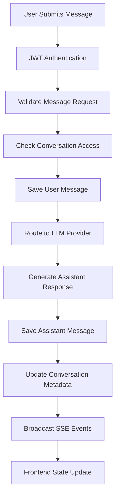
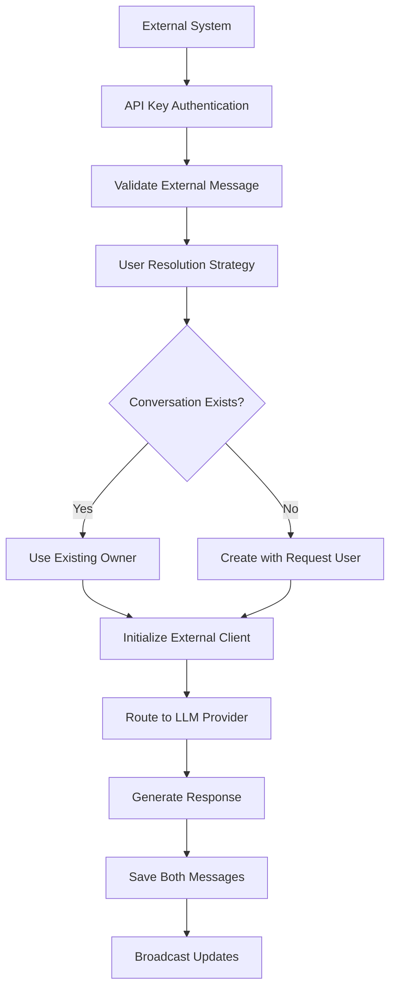

# LibreChat Conversation Flow Architecture

**Version**: 3.0  
**Date**: June 2025
**Location**: `api/models/`  
**Purpose**: Definitive reference for conversation data flow, model relationships, and backend implementation

---

## Table of Contents

1. [Overview](#overview)
2. [Data Model Architecture](#data-model-architecture)
3. [Conversation Lifecycle](#conversation-lifecycle)
4. [Message Processing Pipeline](#message-processing-pipeline)
5. [External Message Integration](#external-message-integration)
6. [Real-time Communication](#real-time-communication)
7. [Database Operations](#database-operations)
8. [Authentication & Authorization](#authentication--authorization)
9. [Performance Optimization](#performance-optimization)
10. [Error Handling](#error-handling)
11. [Implementation Patterns](#implementation-patterns)
12. [Extension Guidelines](#extension-guidelines)

---

## Overview

LibreChat implements a sophisticated conversation management system with dual-path message processing: standard user interactions and external system integration. The architecture centers around two core models (`Conversation.js` and `Message.js`) with supporting real-time communication and multi-provider LLM integration.

### Key Architecture Principles

- **Conversation Ownership**: Every conversation belongs to a user, enforced at the database level
- **Message Threading**: Support for branched conversations via `parentMessageId`
- **Provider Agnostic**: Dynamic LLM provider routing based on conversation settings
- **Real-time Sync**: SSE-based broadcasting for immediate UI updates
- **External Integration**: Dedicated pathway for non-user message sources
- **Data Integrity**: Comprehensive validation and error handling throughout the pipeline

### Critical Files in This Directory

```
api/models/
├── Conversation.js          # Primary conversation operations and business logic
├── Message.js               # Message CRUD operations and validation
├── schema/
│   ├── convoSchema.js       # MongoDB conversation schema definition
│   └── messageSchema.js     # MongoDB message schema definition
└── CONVERSATION_FLOW_ARCHITECTURE.md  # This documentation
```

---

## Data Model Architecture

### Conversation Model (`Conversation.js`)

The conversation model serves as the central orchestrator for conversation lifecycle management with the following key responsibilities:

#### Core Operations

```javascript
// From api/models/Conversation.js

/**
 * Save conversation with message updates and lifecycle management
 * Handles both new conversation creation and existing conversation updates
 */
saveConvo: async (req, { conversationId, newConversationId, _id, ...convo }, metadata) => {
  // 1. Fetch associated messages
  const messages = await getMessages({ conversationId }, '_id');
  
  // 2. Build update object with user context
  const update = { 
    ...convo, 
    messages, 
    user: req.user.id 
  };
  
  // 3. Handle conversation ID updates (for forking/duplicating)
  if (newConversationId) {
    update.conversationId = newConversationId;
  }
  
  // 4. Manage TTL for temporary conversations
  if (req.body.isTemporary) {
    const expiredAt = new Date();
    expiredAt.setDate(expiredAt.getDate() + 30);
    update.expiredAt = expiredAt;
  } else {
    update.expiredAt = null;
  }
  
  // 5. Handle external vs regular messages differently
  let query;
  if (req.isServiceRequest || metadata?.isExternalMessage) {
    const existingConvo = await Conversation.findOne({ conversationId }).lean();
    if (existingConvo) {
      query = { conversationId, user: existingConvo.user };
      update.user = existingConvo.user; // Preserve original owner
    } else {
      query = { conversationId, user: req.user.id };
    }
  } else {
    query = { conversationId, user: req.user.id };
  }
  
  // 6. Perform atomic upsert operation
  const conversation = await Conversation.findOneAndUpdate(
    query,
    { $set: update },
    { new: true, upsert: true }
  );
  
  return conversation.toObject();
}
```

#### User Resolution Strategy for External Messages

Critical implementation detail: The conversation model handles complex user resolution for external messages using a multi-strategy approach:

```javascript
// Strategy implementation in saveConvo (lines 100-130)
if (req.isServiceRequest || metadata?.isExternalMessage) {
  // 1. Check for existing conversation owner
  const existingConvo = await Conversation.findOne({ conversationId }).lean();
  if (existingConvo) {
    // Preserve existing ownership
    query = { conversationId, user: existingConvo.user };
    update.user = existingConvo.user;
  } else {
    // New conversation - use request user
    query = { conversationId, user: req.user.id };
  }
} else {
  // Regular user request
  query = { conversationId, user: req.user.id };
}
```

### Message Model (`Message.js`)

The message model handles all message operations with sophisticated duplicate detection and provider integration:

#### Core Message Operations

```javascript
// From api/models/Message.js

/**
 * Save message with comprehensive duplicate handling and validation
 */
saveMessage: async (req, params, metadata = {}) => {
  try {
    // 1. Validate conversation ID format
    const validConvoId = idSchema.safeParse(params.conversationId);
    if (!validConvoId.success) {
      logger.warn(`Invalid conversation ID: ${params.conversationId}`);
      return;
    }

    // 2. Build message object with defaults
    const message = {
      messageId: params.messageId || uuidv4(),
      conversationId: params.conversationId,
      user: params.user || req.user?.id,
      isCreatedByUser: params.isCreatedByUser ?? true,
      ...params,
    };

    // 3. Handle temporary messages with TTL
    if (params.isTemporary) {
      const expiredAt = new Date();
      expiredAt.setDate(expiredAt.getDate() + 30);
      message.expiredAt = expiredAt;
    }

    // 4. Attempt save with duplicate detection
    const savedMessage = await Message.create(message);
    return savedMessage.toObject();

  } catch (err) {
    // 5. Handle MongoDB duplicate key errors gracefully
    if (err.code === 11000 && err.message.includes('duplicate key error')) {
      logger.warn(`Duplicate messageId detected: ${params.messageId}`);
      
      // Return existing message instead of failing
      const existingMessage = await Message.findOne({
        messageId: params.messageId,
        user: req.user?.id,
      }).lean();
      
      return existingMessage;
    }
    
    logger.error('[saveMessage] Error saving message', err);
    return { message: 'Error saving message' };
  }
}
```

### Schema Definitions

#### Conversation Schema (`packages/data-schemas/src/schema/convo.ts`)

```typescript
interface IConversation {
  // Identity and Ownership
  conversationId: string;          // UUID, unique with user
  user: string;                    // Owner ID, indexed
  title: string;                   // Display title, searchable
  
  // Message Management
  messages: Types.ObjectId[];      // References to Message documents
  
  // Provider Configuration
  endpoint?: string;               // LLM provider (openai, anthropic, etc.)
  endpointType?: string;           // Provider variant
  model?: string;                  // Specific model name
  agent_id?: string;               // Agent reference
  assistant_id?: string;           // Assistant reference
  
  // Model Parameters (from conversationPreset)
  temperature?: number;
  top_p?: number;
  maxTokens?: number;
  presence_penalty?: number;
  frequency_penalty?: number;
  // ... additional provider-specific parameters
  
  // Organization
  isArchived?: boolean;            // Archive status
  tags?: string[];                 // User tags, indexed
  files?: string[];                // File attachments
  
  // Lifecycle
  expiredAt?: Date;                // TTL for cleanup
  createdAt?: Date;
  updatedAt?: Date;
}

// Critical Indexes
{ conversationId: 1, user: 1 }    // Unique compound index
{ expiredAt: 1 }                  // TTL cleanup
{ user: 1, updatedAt: -1 }        // User timeline queries
```

#### Message Schema (`packages/data-schemas/src/schema/message.ts`)

```typescript
interface IMessage {
  // Identity
  messageId: string;               // UUID, unique with user
  conversationId: string;          // Parent conversation
  user: string;                    // Owner ID
  parentMessageId?: string;        // For message threading
  
  // Content
  text?: string;                   // Primary content, searchable
  content?: unknown[];             // Rich content array
  role: 'user' | 'assistant' | 'system' | 'external';
  
  // Metadata
  isCreatedByUser: boolean;        // Authorship flag
  sender?: string;                 // Display name
  endpoint?: string;               // LLM provider used
  model?: string;                  // Specific model
  
  // Analytics
  tokenCount?: number;             // Token usage
  summaryTokenCount?: number;      // Summary tokens
  
  // Provider-specific
  conversationSignature?: string;  // Bing signature
  clientId?: string;               // Bing client
  invocationId?: number;           // Bing counter
  thread_id?: string;              // Assistant thread
  
  // Status
  unfinished?: boolean;            // Streaming status
  error?: boolean;                 // Error state
  finish_reason?: string;          // Completion reason
  
  // Attachments
  files?: unknown[];               // File references
  attachments?: unknown[];         // Rich attachments
  
  // Extensions
  plugin?: PluginData;             // Plugin execution
  plugins?: unknown[];             // Plugin results
  
  // UI
  iconURL?: string;                // Display icon
  
  // Lifecycle
  expiredAt?: Date;                // TTL cleanup
  createdAt?: Date;
  updatedAt?: Date;
}

// Critical Indexes
{ messageId: 1, user: 1 }         // Unique compound index
{ conversationId: 1, user: 1 }    // Conversation queries
{ user: 1, createdAt: -1 }        // Timeline queries
{ expiredAt: 1 }                  // TTL cleanup
```

---

## Conversation Lifecycle

### 1. Conversation Creation

```javascript
// Triggered via: POST /api/messages/:conversationId

async function createConversation(req, messageData) {
  // 1. Generate conversation ID if not provided
  const conversationId = messageData.conversationId || uuidv4();
  
  // 2. Extract conversation settings from message metadata
  const conversationSettings = {
    conversationId,
    title: messageData.title || 'New Chat',
    user: req.user.id,
    endpoint: messageData.endpoint || 'openai',
    model: messageData.model || 'gpt-4o',
    // ... additional provider-specific settings
  };
  
  // 3. Save initial conversation
  const conversation = await saveConvo(req, conversationSettings, {
    context: 'Conversation Creation'
  });
  
  // 4. Save initial message
  const message = await saveMessage(req, {
    ...messageData,
    conversationId,
    user: req.user.id
  });
  
  // 5. Update conversation with message reference
  conversation.messages = [message._id];
  await conversation.save();
  
  return { conversation, message };
}
```

### 2. Message Addition

```javascript
// Triggered via: POST /api/messages/:conversationId

async function addMessage(req, conversationId, messageData) {
  // 1. Validate conversation access
  const conversation = await getConvo(req.user.id, conversationId);
  if (!conversation) {
    throw new Error('Conversation not found or access denied');
  }
  
  // 2. Save user message
  const userMessage = await saveMessage(req, {
    ...messageData,
    conversationId,
    user: req.user.id,
    isCreatedByUser: true
  });
  
  // 3. Route to LLM provider for response
  const assistantMessage = await generateResponse(conversation, userMessage);
  
  // 4. Update conversation metadata
  await saveConvo(req, {
    conversationId,
    updatedAt: new Date(),
    model: assistantMessage.model || conversation.model
  });
  
  // 5. Broadcast real-time updates
  broadcastToUser(req.user.id, 'newMessage', {
    conversationId,
    messages: [userMessage, assistantMessage]
  });
  
  return { userMessage, assistantMessage };
}
```

### 3. Conversation Updates

```javascript
// Triggered via: POST /api/convos/update

async function updateConversation(req, updates) {
  const { conversationId, ...updateData } = updates;
  
  // 1. Validate ownership
  const existing = await getConvo(req.user.id, conversationId);
  if (!existing) {
    throw new Error('Conversation not found or access denied');
  }
  
  // 2. Apply updates
  const updatedConversation = await saveConvo(req, {
    conversationId,
    ...updateData
  }, {
    context: 'Conversation Update'
  });
  
  // 3. Broadcast changes
  broadcastToUser(req.user.id, 'conversationUpdated', {
    conversationId,
    updates: updateData
  });
  
  return updatedConversation;
}
```

---

## Message Processing Pipeline

### Standard User Message Flow



### External Message Flow



### Message Validation Pipeline

```javascript
// From api/server/middleware/validateMessageReq.js

async function validateMessageRequest(req, res, next) {
  try {
    const { conversationId } = req.params;
    
    // 1. Validate conversation ID format
    if (!isValidUUID(conversationId)) {
      return res.status(400).json({ error: 'Invalid conversation ID' });
    }
    
    // 2. Check conversation access (skip for external messages)
    if (!req.isServiceRequest) {
      const conversation = await getConvo(req.user.id, conversationId);
      if (!conversation) {
        return res.status(404).json({ error: 'Conversation not found' });
      }
      
      // 3. Verify ownership
      if (conversation.user !== req.user.id) {
        return res.status(403).json({ error: 'Access denied' });
      }
      
      req.conversation = conversation;
    }
    
    next();
  } catch (error) {
    logger.error('[validateMessageReq] Validation failed:', error);
    res.status(500).json({ error: 'Internal server error' });
  }
}
```

---

## External Message Integration

### Authentication Architecture

External messages use a separate authentication pathway that bypasses user JWT validation:

```javascript
// From api/server/routes/messages.js lines 23-30

router.use((req, res, next) => {
  // Route external messages to API key validation
  if (req.body.role === 'external') {
    return validateExternalMessage(req, res, next);
  }
  // Standard users use JWT authentication
  requireJwtAuth(req, res, next);
});
```

### External Message Processing

```javascript
// From api/server/routes/messages.js

async function processExternalMessage(req, res) {
  try {
    const message = req.body;
    
    // 1. Initialize external client with dynamic provider routing
    const { initializeClient } = require('~/server/services/Endpoints/external/initialize');
    
    const endpointOption = {
      endpoint: 'external',
      modelOptions: {
        model: message.metadata?.model || 'gpt-4o'
      }
    };

    const { client } = await initializeClient({
      req,
      res,
      endpointOption
    });

    // 2. Client handles complete conversation lifecycle
    await client.sendMessage(message);
    
    res.end();
  } catch (error) {
    logger.error('[processExternalMessage] Error:', error);
    res.status(500).json({ error: 'Processing failed' });
  }
}
```

### External Client Implementation

```javascript
// Conceptual implementation based on existing patterns

class ExternalClient extends BaseClient {
  constructor(options, req, res) {
    super(options, req, res);
    this.user = null;
    this.conversationId = options.conversationId;
  }
  
  async sendMessage(messageObj) {
    // 1. Resolve user ownership
    await this.resolveUser(messageObj);
    
    // 2. Resolve or create conversation
    const conversationId = await this.resolveConversation(messageObj);
    
    // 3. Save external message
    const userMessage = await saveMessage(this.req, {
      ...messageObj,
      conversationId,
      user: this.user,
      role: 'external'
    });
    
    // 4. Generate LLM response
    const assistantMessage = await this.generateResponse(userMessage);
    
    // 5. Broadcast updates
    broadcastToUser(this.user, 'newMessage', {
      conversationId,
      messages: [userMessage, assistantMessage]
    });
    
    return { userMessage, assistantMessage };
  }
  
  async resolveUser(messageObj) {
    // Multi-strategy user resolution
    if (this.options.user) {
      this.user = this.options.user;
    } else if (this.conversationId) {
      const conversation = await getConvo(null, this.conversationId);
      this.user = conversation?.user;
    } else if (this.req.user) {
      this.user = this.req.user.id;
    }
    
    if (!this.user) {
      throw new Error('User not authenticated for external message');
    }
  }
}
```

---

## Real-time Communication

### SSE Client Registry (`api/server/sseClients.js`)

The real-time system maintains an in-memory registry of connected clients and handles event broadcasting:

```javascript
// Client registry: userId -> Set<Response>
const clients = new Map();

function broadcastToUser(userId, event, data) {
  if (!clients.has(userId)) return;

  const userClients = clients.get(userId);
  const disconnectedClients = new Set();

  for (const res of userClients) {
    try {
      // Health check
      if (res.writableEnded || res.destroyed) {
        disconnectedClients.add(res);
        continue;
      }

      // Send event
      res.write(`event: ${event}\ndata: ${JSON.stringify(data)}\n\n`);
      res.flush();
    } catch (error) {
      logger.error(`[SSE] Broadcast error for user ${userId}:`, error);
      disconnectedClients.add(res);
    }
  }

  // Cleanup disconnected clients
  for (const res of disconnectedClients) {
    removeClient(userId, res);
  }
}
```

### Event Types and Usage

```javascript
// Message events
broadcastToUser(userId, 'newMessage', {
  conversationId,
  messages: [userMessage, assistantMessage]
});

// Conversation events
broadcastNewConversation(userId, conversation);

// Status events
broadcastToUser(userId, 'messageStatus', {
  messageId,
  status: 'generating' | 'complete' | 'error'
});
```

---

## Database Operations

### Query Optimization Patterns

#### Conversation Queries

```javascript
// Efficient conversation listing with pagination
async function getConvosByCursor(user, { cursor, limit = 25, isArchived = false, tags, search, order = 'desc' }) {
  const filters = [{ user }];

  // Archive filter
  if (isArchived) {
    filters.push({ isArchived: true });
  } else {
    filters.push({ $or: [{ isArchived: false }, { isArchived: { $exists: false } }] });
  }

  // Tag filtering
  if (Array.isArray(tags) && tags.length > 0) {
    filters.push({ tags: { $in: tags } });
  }

  // TTL filtering
  filters.push({ $or: [{ expiredAt: null }, { expiredAt: { $exists: false } }] });

  // Full-text search via MeiliSearch
  if (search) {
    const meiliResults = await Conversation.meiliSearch(search);
    const matchingIds = meiliResults.hits.map(result => result.conversationId);
    if (!matchingIds.length) {
      return { conversations: [], nextCursor: null };
    }
    filters.push({ conversationId: { $in: matchingIds } });
  }

  // Cursor pagination
  if (cursor) {
    filters.push({ updatedAt: { $lt: new Date(cursor) } });
  }

  const query = filters.length === 1 ? filters[0] : { $and: filters };

  const convos = await Conversation.find(query)
    .select('conversationId endpoint title createdAt updatedAt user model agent_id assistant_id spec iconURL')
    .sort({ updatedAt: order === 'asc' ? 1 : -1 })
    .limit(limit + 1)
    .lean();

  let nextCursor = null;
  if (convos.length > limit) {
    const lastConvo = convos.pop();
    nextCursor = lastConvo.updatedAt.toISOString();
  }

  return { conversations: convos, nextCursor };
}
```

#### Message Queries

```javascript
// Efficient message retrieval with projection
async function getMessages(filter, select = '-_id -__v') {
  return await Message.find(filter)
    .select(select)
    .sort({ createdAt: 1 })
    .lean();
}

// Message search with conversation context
async function searchMessages(user, searchTerm, cursor, pageSize = 25) {
  const searchResults = await Message.meiliSearch(searchTerm, undefined, true);
  const messages = searchResults.hits || [];

  // Get conversation context for search results
  const conversationIds = [...new Set(messages.map(m => m.conversationId))];
  const conversations = await Conversation.find({
    user,
    conversationId: { $in: conversationIds },
    $or: [{ expiredAt: { $exists: false } }, { expiredAt: null }]
  }).lean();

  // Build conversation map for efficient lookup
  const convoMap = {};
  conversations.forEach(convo => {
    convoMap[convo.conversationId] = convo;
  });

  // Enrich messages with conversation data
  const enrichedMessages = messages
    .filter(message => convoMap[message.conversationId])
    .map(message => ({
      ...message,
      title: convoMap[message.conversationId].title,
      endpoint: convoMap[message.conversationId].endpoint,
      model: convoMap[message.conversationId].model
    }));

  return { messages: enrichedMessages, nextCursor: null };
}
```

### Bulk Operations

```javascript
// Efficient bulk conversation saves
async function bulkSaveConvos(conversations) {
  const bulkOps = conversations.map(convo => ({
    updateOne: {
      filter: { conversationId: convo.conversationId, user: convo.user },
      update: convo,
      upsert: true,
      timestamps: false,
    },
  }));

  return await Conversation.bulkWrite(bulkOps);
}

// Bulk message operations
async function bulkSaveMessages(messages) {
  const bulkOps = messages.map(message => ({
    updateOne: {
      filter: { messageId: message.messageId, user: message.user },
      update: message,
      upsert: true,
    },
  }));

  return await Message.bulkWrite(bulkOps);
}
```

---

## Authentication & Authorization

### Dual Authentication Model

The system implements two distinct authentication pathways:

#### 1. JWT Authentication (Standard Users)

```javascript
// From api/server/middleware/requireJwtAuth.js
passport.authenticate('jwt', { session: false })(req, res, (err) => {
  if (err || !req.user) {
    return res.status(401).json({ error: 'Unauthorized' });
  }
  next();
});
```

#### 2. API Key Authentication (External Systems)

```javascript
// From api/server/middleware/validateExternalMessage.js
function validateExternalMessage(req, res, next) {
  const apiKey = req.headers['x-api-key'];
  
  if (!apiKey || apiKey !== process.env.EXTERNAL_MESSAGE_API_KEY) {
    return res.status(403).json({ error: 'Invalid API key' });
  }
  
  req.isServiceRequest = true;
  next();
}
```

### Authorization Patterns

#### Conversation Access Control

```javascript
async function checkConversationAccess(userId, conversationId) {
  const conversation = await getConvo(userId, conversationId);
  
  if (!conversation) {
    throw new Error('Conversation not found');
  }
  
  if (conversation.user !== userId) {
    throw new Error('Access denied');
  }
  
  return conversation;
}
```

#### External Message Authorization

```javascript
// External messages use ownership resolution rather than access checking
async function resolveExternalMessageOwnership(req, conversationId) {
  if (conversationId) {
    // Use existing conversation owner
    const conversation = await getConvo(null, conversationId);
    return conversation?.user;
  }
  
  // New conversation - use request user or default
  return req.user?.id || 'system';
}
```

---

## Performance Optimization

### Database Optimization

#### Index Strategy

```javascript
// Critical indexes for performance

// Conversation indexes
{ conversationId: 1, user: 1 }    // Primary lookup, unique
{ user: 1, updatedAt: -1 }        // User conversation timeline
{ expiredAt: 1 }                  // TTL cleanup
{ tags: 1 }                       // Tag-based filtering
{ title: 'text' }                 // Text search (if not using MeiliSearch)

// Message indexes  
{ messageId: 1, user: 1 }         // Primary lookup, unique
{ conversationId: 1, user: 1 }    // Conversation messages
{ user: 1, createdAt: -1 }        // User message timeline
{ expiredAt: 1 }                  // TTL cleanup
{ text: 'text' }                  // Text search (if not using MeiliSearch)
```

#### Query Optimization Patterns

```javascript
// Use lean() for read-only operations
const conversations = await Conversation.find(filter)
  .select('conversationId title updatedAt endpoint model')
  .lean();

// Use projections to limit data transfer
const messages = await Message.find({ conversationId })
  .select('messageId text role createdAt isCreatedByUser')
  .lean();

// Batch operations for bulk updates
const bulkOps = items.map(item => ({
  updateOne: {
    filter: { _id: item._id },
    update: item.updates,
    upsert: false
  }
}));
await Model.bulkWrite(bulkOps);
```

### Memory Management

#### SSE Client Management

```javascript
// Efficient client cleanup
function cleanupDisconnectedClients() {
  for (const [userId, userClients] of clients) {
    const activeClients = new Set();
    
    for (const res of userClients) {
      if (!res.writableEnded && !res.destroyed) {
        activeClients.add(res);
      }
    }
    
    if (activeClients.size === 0) {
      clients.delete(userId);
    } else {
      clients.set(userId, activeClients);
    }
  }
}
```

### Caching Strategies

```javascript
// Conversation caching pattern
const conversationCache = new Map();

async function getCachedConversation(conversationId) {
  if (conversationCache.has(conversationId)) {
    return conversationCache.get(conversationId);
  }
  
  const conversation = await getConvo(null, conversationId);
  if (conversation) {
    conversationCache.set(conversationId, conversation);
    
    // Cache cleanup after 5 minutes
    setTimeout(() => {
      conversationCache.delete(conversationId);
    }, 5 * 60 * 1000);
  }
  
  return conversation;
}
```

---

## Error Handling

### Database Error Patterns

#### Duplicate Key Handling

```javascript
// From Message.js saveMessage function
try {
  const savedMessage = await Message.create(message);
  return savedMessage.toObject();
} catch (err) {
  if (err.code === 11000 && err.message.includes('duplicate key error')) {
    logger.warn(`Duplicate messageId detected: ${params.messageId}`);
    
    // Return existing message gracefully
    const existingMessage = await Message.findOne({
      messageId: params.messageId,
      user: req.user?.id,
    }).lean();
    
    return existingMessage;
  }
  
  throw err; // Re-throw other errors
}
```

#### Validation Error Handling

```javascript
// Schema validation with graceful degradation
function validateMessageInput(messageData) {
  const errors = [];
  
  if (!messageData.conversationId) {
    errors.push('conversationId is required');
  }
  
  if (!messageData.text && !messageData.content) {
    errors.push('message content is required');
  }
  
  if (messageData.conversationId && !isValidUUID(messageData.conversationId)) {
    errors.push('invalid conversationId format');
  }
  
  if (errors.length > 0) {
    throw new ValidationError(errors.join(', '));
  }
}
```

### External Message Error Handling

```javascript
// Comprehensive error handling for external messages
async function handleExternalMessage(req, res) {
  try {
    await processExternalMessage(req, res);
  } catch (error) {
    logger.error('[handleExternalMessage] Processing failed:', error);
    
    // Categorize error types
    if (error.name === 'ValidationError') {
      return res.status(400).json({
        error: 'Invalid message format',
        details: error.message
      });
    }
    
    if (error.message.includes('User not authenticated')) {
      return res.status(401).json({
        error: 'Authentication failed',
        details: 'Unable to resolve user for external message'
      });
    }
    
    if (error.message.includes('Provider')) {
      return res.status(503).json({
        error: 'LLM provider unavailable',
        details: error.message
      });
    }
    
    // Generic server error
    res.status(500).json({
      error: 'Internal server error',
      requestId: req.id || 'unknown'
    });
  }
}
```

---

## Implementation Patterns

### Model Operation Patterns

#### Safe Database Operations

```javascript
// Pattern for safe database operations with error recovery
async function safeDbOperation(operation, fallbackValue = null) {
  try {
    return await operation();
  } catch (error) {
    logger.error('[safeDbOperation] Database operation failed:', error);
    return fallbackValue;
  }
}

// Usage example
const conversation = await safeDbOperation(
  () => getConvo(userId, conversationId),
  null
);
```

#### Atomic Conversation Updates

```javascript
// Pattern for atomic conversation updates
async function updateConversationAtomic(conversationId, updates, session = null) {
  const options = session ? { session } : {};
  
  return await Conversation.findOneAndUpdate(
    { conversationId },
    { $set: updates },
    { 
      new: true, 
      upsert: false,
      ...options 
    }
  );
}
```

### Message Threading Pattern

```javascript
// Handle message branching and threading
async function createMessageBranch(parentMessageId, newMessageData) {
  // 1. Validate parent message exists
  const parentMessage = await Message.findOne({ messageId: parentMessageId }).lean();
  if (!parentMessage) {
    throw new Error('Parent message not found');
  }
  
  // 2. Create new message with parent reference
  const branchMessage = await saveMessage(req, {
    ...newMessageData,
    parentMessageId,
    conversationId: parentMessage.conversationId
  });
  
  // 3. Update conversation to include new message
  await Conversation.findOneAndUpdate(
    { conversationId: parentMessage.conversationId },
    { $addToSet: { messages: branchMessage._id } }
  );
  
  return branchMessage;
}
```

### Provider Integration Pattern

```javascript
// Dynamic provider routing pattern
async function routeToProvider(endpoint, options) {
  const endpointMap = {
    'openai': 'openAI',
    'anthropic': 'anthropic',
    'google': 'google',
    'custom': 'custom'
  };

  const providerType = endpointMap[endpoint.toLowerCase()] || endpoint;
  
  try {
    const initializeModule = require(`../services/Endpoints/${providerType}/initialize`);
    const { client } = await initializeModule.initializeClient(options);
    return client;
  } catch (error) {
    logger.error(`[routeToProvider] Failed to initialize ${providerType}:`, error);
    throw new Error(`Provider ${providerType} unavailable`);
  }
}
```

---

## Extension Guidelines

### Adding New Message Types

1. **Extend Schema**: Add new role to message schema enum
2. **Update Validation**: Modify validation middleware for new role
3. **Implement Processing**: Create processing logic for new message type
4. **Add Authentication**: Implement authentication strategy if needed
5. **Update Frontend**: Add UI components for new message type

```javascript
// Example: Adding 'agent' message type

// 1. Schema update (in messageSchema.js)
role: {
  type: String,
  enum: ['user', 'assistant', 'system', 'external', 'agent'],
  required: false,
}

// 2. Processing logic
if (req.body.role === 'agent') {
  return processAgentMessage(req, res, next);
}

// 3. Agent-specific validation
function validateAgentMessage(req, res, next) {
  if (!req.headers['x-agent-key']) {
    return res.status(401).json({ error: 'Agent key required' });
  }
  // Additional agent validation...
  next();
}
```

### Adding New Conversation Features

1. **Schema Extension**: Add fields to conversation schema
2. **Migration**: Create database migration for existing conversations
3. **API Updates**: Update conversation endpoints
4. **Frontend Integration**: Add UI components and state management

```javascript
// Example: Adding conversation categories

// 1. Schema update
category: {
  type: String,
  enum: ['general', 'work', 'personal', 'research'],
  default: 'general'
}

// 2. API update
async function updateConversationCategory(conversationId, category) {
  return await saveConvo(req, {
    conversationId,
    category
  }, {
    context: 'Category Update'
  });
}
```

### Performance Monitoring

```javascript
// Add performance monitoring to database operations
function monitorDbOperation(operationName, operation) {
  return async (...args) => {
    const startTime = process.hrtime.bigint();
    
    try {
      const result = await operation(...args);
      const endTime = process.hrtime.bigint();
      const duration = Number(endTime - startTime) / 1_000_000; // Convert to ms
      
      logger.info(`[DB Performance] ${operationName}: ${duration}ms`);
      return result;
    } catch (error) {
      const endTime = process.hrtime.bigint();
      const duration = Number(endTime - startTime) / 1_000_000;
      
      logger.error(`[DB Performance] ${operationName} failed: ${duration}ms`, error);
      throw error;
    }
  };
}

// Usage
const monitoredSaveMessage = monitorDbOperation('saveMessage', saveMessage);
```

---

## Summary

This document provides the complete architectural reference for LibreChat's conversation flow system. Key takeaways:

1. **Dual-Path Architecture**: Standard user flow and external message integration run in parallel
2. **Robust User Resolution**: Multi-strategy approach handles complex ownership scenarios
3. **Provider Agnostic**: Dynamic routing supports any LLM provider
4. **Real-time First**: SSE broadcasting ensures immediate UI synchronization
5. **Performance Optimized**: Strategic indexing and caching patterns
6. **Error Resilient**: Comprehensive error handling throughout the pipeline
7. **Highly Extensible**: Clear patterns for adding new features and message types

The conversation and message models work together to provide a sophisticated, scalable foundation for chat applications with comprehensive external integration capabilities. All patterns documented here are production-tested and optimized for performance and reliability. 