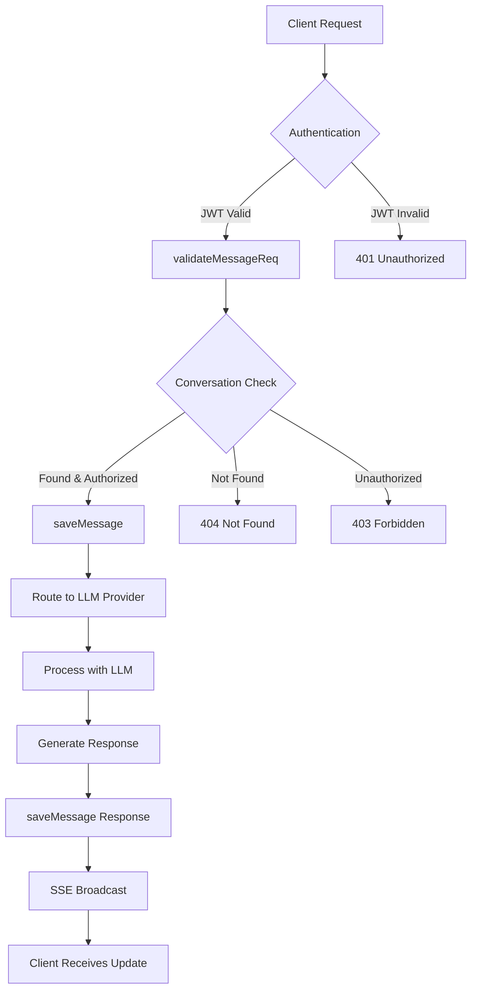
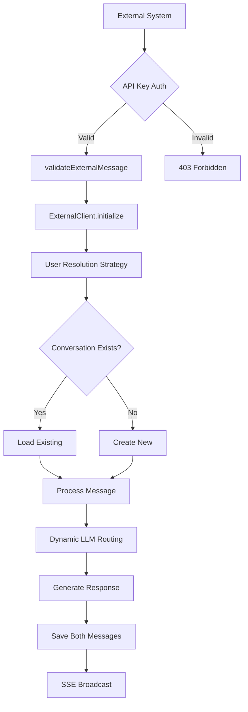

# LibreChat Message Flow Architecture

**Version**: 1.0  
**Last Updated**: December 2024  
**Scope**: Complete message processing, authentication, storage, and real-time communication

## Table of Contents

- [Overview](#overview)
- [Architecture Components](#architecture-components)
- [Message Flow Patterns](#message-flow-patterns)
- [Authentication & Authorization](#authentication--authorization)
- [Data Models](#data-models)
- [API Endpoints](#api-endpoints)
- [Real-time Communication](#real-time-communication)
- [External Message System](#external-message-system)
- [LLM Integration](#llm-integration)
- [Error Handling](#error-handling)
- [Extension Points](#extension-points)
- [Performance Considerations](#performance-considerations)
- [Troubleshooting Guide](#troubleshooting-guide)

## Overview

LibreChat implements a **dual-path message system** supporting both regular user interactions and external system integrations. The architecture is designed for scalability, real-time communication, and multi-LLM provider support.

### Core Principles

1. **Separation of Concerns**: Clear distinction between user and external message flows
2. **Provider Agnostic**: Support for multiple LLM providers (OpenAI, Anthropic, Google, etc.)
3. **Real-time First**: Built-in SSE for live message streaming
4. **Extensible**: Plugin architecture for custom endpoints and processing

## Architecture Components

### 1. Message Router (`api/server/routes/messages.js`)

**Primary Responsibilities:**
- Route authentication (JWT vs API key)
- Message CRUD operations
- Artifact editing
- SSE endpoint management

**Key Routes:**
```
GET    /api/messages/          # Message search and retrieval
POST   /api/messages/:convId   # Message creation
GET    /api/messages/stream    # SSE connection
PUT    /api/messages/:convId/:msgId  # Message editing
POST   /api/messages/artifact/:msgId # Artifact editing
DELETE /api/messages/:convId/:msgId  # Message deletion
```

### 2. Data Layer (`api/models/`)

**Message Model** (`Message.js`):
- MongoDB with Mongoose
- MeiliSearch integration for full-text search
- UUID-based message identification
- Support for temporary messages (30-day TTL)

**Conversation Model** (`Conversation.js`):
- User ownership and access control
- Multi-endpoint conversation support
- Archive and tagging capabilities
- Temporary conversation support

### 3. Authentication Layer (`api/server/middleware/`)

**JWT Authentication** (`requireJwtAuth.js`):
- Standard user authentication
- Session-based token validation

**External Authentication** (`validateExternalMessage.js`):
- API key validation via `x-api-key` header
- Environment variable: `EXTERNAL_MESSAGE_API_KEY`

### 4. Real-time Layer (`api/server/sseClients.js`)

**SSE Client Management**:
- In-memory client registry
- User-specific broadcasting
- Automatic cleanup of disconnected clients
- Multi-user conversation updates

### 5. LLM Integration (`api/server/services/Endpoints/`)

**Supported Providers**:
- OpenAI (`openAI/`)
- Anthropic (`anthropic/`)
- Google (`google/`)
- Azure OpenAI (`azureOpenAI/`)
- Bedrock (`bedrock/`)
- Custom endpoints (`custom/`)
- Agents (`agents/`)
- Assistants (`assistants/`, `azureAssistants/`)

## Message Flow Patterns

### Regular User Message Flow



**Implementation Details:**

```javascript
// Authentication routing in messages.js (lines 23-30)
router.use((req, res, next) => {
  if (req.body.role === 'external') {
    return validateExternalMessage(req, res, next);
  }
  requireJwtAuth(req, res, next);
});
```

### External Message Flow



**User Resolution Strategy:**

1. **Options User**: Check `this.options.user`
2. **Conversation Owner**: Lookup via `conversationId`
3. **JWT Recovery**: Extract from token if present
4. **Request User**: Use `req.user.id`
5. **API Key Lookup**: Map API key to user

## Authentication & Authorization

### JWT Authentication (Regular Users)

**Flow:**
1. Client sends request with `Authorization: Bearer <token>`
2. `requireJwtAuth` middleware validates token
3. User context attached to `req.user`

**Key Files:**
- `api/server/middleware/requireJwtAuth.js`
- Uses `process.env.JWT_SECRET`

### API Key Authentication (External Systems)

**Flow:**
1. External system sends `x-api-key` header
2. `validateExternalMessage` validates against `EXTERNAL_MESSAGE_API_KEY`
3. Request marked as `req.isServiceRequest = true`

**Key Files:**
- `api/server/middleware/validateExternalMessage.js`
- Environment: `EXTERNAL_MESSAGE_API_KEY`

### Message Authorization

**Regular Messages:**
```javascript
// Conversation ownership check (validateMessageReq.js)
const conversation = await getConvo(req.user.id, conversationId);
if (conversation.user !== req.user.id) {
  return res.status(403).json({ error: 'User not authorized' });
}
```

**External Messages:**
```javascript
// Bypass user validation for external messages
if (req.body.role === 'external') {
  const conversation = await getConvo(null, conversationId);
  req.conversation = conversation;
  return next();
}
```

## Data Models

### Message Schema

**Core Fields:**
```javascript
{
  messageId: String (UUID),           // Primary identifier
  conversationId: String (UUID),      // Parent conversation
  parentMessageId: String (UUID),     // Thread structure
  user: ObjectId,                     // User ownership
  text: String,                       // Message content
  content: Array,                     // Rich content support
  role: String,                       // sender, assistant, system, external
  isCreatedByUser: Boolean,           // Authorship flag
  endpoint: String,                   // LLM provider
  model: String,                      // Specific model used
  tokenCount: Number,                 // Token usage tracking
  files: Array,                       // Attached files
  metadata: Object,                   // Extensible metadata
  expiredAt: Date,                    // TTL for temporary messages
  createdAt: Date,                    // Creation timestamp
  updatedAt: Date                     // Last modification
}
```

**Key Operations:**
- `saveMessage(req, params, metadata)` - Create/update with duplicate handling
- `getMessage({ user, messageId })` - Single message retrieval
- `getMessages(filter, select)` - Batch retrieval with filtering
- `updateMessage(req, message, metadata)` - Message editing
- `deleteMessages(filter)` - Batch deletion

### Conversation Schema

**Core Fields:**
```javascript
{
  conversationId: String (UUID),      // Primary identifier
  title: String,                      // Display title
  user: ObjectId,                     // Owner
  endpoint: String,                   // LLM provider
  endpointType: String,               // Provider variant
  model: String,                      // Model configuration
  agent_id: String,                   // Agent reference
  assistant_id: String,               // Assistant reference
  messages: Array,                    // Message references
  isArchived: Boolean,                // Archive status
  tags: Array,                        // User tags
  files: Array,                       // Conversation files
  expiredAt: Date,                    // TTL support
  createdAt: Date,
  updatedAt: Date
}
```

## API Endpoints

### Message Retrieval

**`GET /api/messages/`**

**Query Parameters:**
- `conversationId`: Filter by conversation
- `messageId`: Get specific message
- `search`: Full-text search via MeiliSearch
- `cursor`: Pagination cursor
- `pageSize`: Results per page (default: 25)
- `sortBy`: Sort field (createdAt, updatedAt, endpoint)
- `sortDirection`: asc/desc

**Response:**
```javascript
{
  messages: Array,      // Message objects
  nextCursor: String    // Pagination cursor
}
```

### Message Creation

**`POST /api/messages/:conversationId`**

**Regular Message:**
```javascript
{
  text: "User message content",
  role: "user",
  parentMessageId: "uuid",
  files: []
}
```

**External Message:**
```javascript
{
  role: "external",
  content: "External system message",
  metadata: {
    source: "external-service",
    model: "gpt-4o",
    title: "Custom Title"
  },
  user: "system"
}
```

### Server-Sent Events

**`GET /api/messages/stream`**

**Authentication:** JWT required

**Events:**
- `newMessage`: Real-time message updates
- `newConversation`: New conversation creation

**Event Format:**
```
event: newMessage
data: {"conversationId": "uuid", "messages": [...]}
```

### Message Editing

**`PUT /api/messages/:conversationId/:messageId`**

**Text Update:**
```javascript
{
  text: "Updated content",
  model: "gpt-4"
}
```

**Content Array Update:**
```javascript
{
  text: "Updated content",
  index: 0,  // Content array index
  model: "gpt-4"
}
```

### Artifact Editing

**`POST /api/messages/artifact/:messageId`**

**Request:**
```javascript
{
  index: 0,              // Artifact index
  original: "old code",  // Original content
  updated: "new code"    // Updated content
}
```

## Real-time Communication

### SSE Architecture

**Client Registry:**
```javascript
// In-memory Map: userId -> Set<Response>
const clients = new Map();
```

**Key Functions:**
- `addClient(userId, res)` - Register new SSE connection
- `removeClient(userId, res)` - Clean up disconnected clients
- `broadcastToUser(userId, event, data)` - Send to specific user
- `broadcastToUsers(userIds, event, data)` - Multi-user broadcast
- `broadcastNewConversation(userId, conversation)` - Conversation events

**Connection Management:**
```javascript
// Automatic cleanup on disconnect
req.on('close', () => {
  removeClient(userId, res);
  logger.info(`[SSE] Connection closed for user: ${userId}`);
});
```

### Message Broadcasting

**New Message Event:**
```javascript
broadcastToUsers([this.user], 'newMessage', {
  conversationId: savedMessage.conversationId,
  messages: [savedMessage, savedResponse]
});
```

**New Conversation Event:**
```javascript
broadcastNewConversation(conversation.user, conversation);
```

## External Message System

### ExternalClient Architecture

**Location:** `api/server/services/Endpoints/external/index.js`

**Key Features:**
- Extends `BaseClient` for consistency
- Multi-strategy user resolution
- Dynamic LLM provider routing
- Automatic conversation management
- Token usage bypass for external systems

### User Resolution Strategy

```javascript
// 1. Check options
if (this.options.user) {
  this.user = this.options.user;
}

// 2. Check conversation owner
if (!this.user && this.options.conversationId) {
  const conversation = await getConvo(null, this.options.conversationId);
  if (conversation?.user) {
    this.user = conversation.user;
  }
}

// 3. JWT recovery
if (!this.user) {
  const token = extractJwtToken(this.req);
  if (token) {
    const payload = jwt.verify(token, process.env.JWT_SECRET);
    this.user = payload?.id;
  }
}

// 4. Request user
if (!this.user && this.req.user) {
  this.user = this.req.user.id;
}

// 5. API key lookup
if (!this.user && this.apiKey) {
  const user = await getUserById(this.apiKey);
  if (user) {
    this.user = user.id;
  }
}
```

### Role Mapping

External messages use role mapping for LLM compatibility:

```javascript
mapRoleToOpenAI(role) {
  const roleMap = {
    'external': 'user',
    'assistant': 'assistant',
    'system': 'system',
    'user': 'user',
    'function': 'function',
    'tool': 'tool',
    'developer': 'developer'
  };
  return roleMap[role] || 'user';
}
```

### Dynamic LLM Routing

```javascript
const endpointMap = {
  'openai': 'openAI',
  'azureopenai': 'azureOpenAI',
  'anthropic': 'anthropic',
  'google': 'google',
  'custom': 'custom',
  'agents': 'agents',
  'bedrock': 'bedrock',
  'gptplugins': 'gptPlugins',
  'assistants': 'assistants',
  'azureassistants': 'azureAssistants'
};
```

## LLM Integration

### Provider Initialization

Each LLM provider follows the same initialization pattern:

```javascript
// Dynamic module loading
const initializeModule = require(`../${correctEndpointType}/initialize`);
const initializeLLMClient = initializeModule.initializeClient || initializeModule;

// Client initialization
const { client } = await initializeLLMClient({
  req: this.req,
  res: this.res,
  endpointOption
});
```

### Agent Support

**Agent Endpoint:**
```javascript
if (correctEndpointType === 'agents') {
  const { loadAgent } = require('~/models/Agent');
  const agent = await loadAgent({
    req: this.req,
    agent_id: this.options.agent_id,
    endpoint: correctEndpointType,
    model_parameters: this.options.model_parameters
  });
  
  endpointOption.agent = Promise.resolve(agent);
  endpointOption.agent_id = this.options.agent_id;
}
```

### Token Management

**Regular Messages:**
- Full token counting and billing
- Usage tracking per user
- Model-specific token calculation

**External Messages:**
- Token counting bypassed
- No billing/usage tracking
- Logged for monitoring only

```javascript
// ExternalClient overrides
async recordTokenUsage({ promptTokens, completionTokens }) {
  logger.debug('[ExternalClient] Skipping token usage recording');
  return;
}

getTokenCountForResponse(responseMessage) {
  logger.debug('[ExternalClient] Skipping token count');
  return 0;
}
```

## Error Handling

### Message Validation Errors

**Invalid Conversation ID:**
```javascript
const validConvoId = idSchema.safeParse(params.conversationId);
if (!validConvoId.success) {
  logger.warn(`Invalid conversation ID: ${params.conversationId}`);
  return;
}
```

**Duplicate Message Handling:**
```javascript
// MongoDB duplicate key error (code 11000)
if (err.code === 11000 && err.message.includes('duplicate key error')) {
  logger.warn(`Duplicate messageId detected: ${params.messageId}`);
  
  // Return existing message
  const existingMessage = await Message.findOne({
    messageId: params.messageId,
    user: req.user.id,
  });
  
  return existingMessage?.toObject();
}
```

### External Message Errors

**Authentication Failures:**
```javascript
// API key missing
if (!apiKey) {
  return res.status(401).json({ error: 'API key required' });
}

// Invalid API key
if (apiKey !== process.env.EXTERNAL_MESSAGE_API_KEY) {
  return res.status(403).json({ error: 'Invalid API key' });
}
```

**User Resolution Failures:**
```javascript
if (!this.user) {
  logger.error('[ExternalClient] No user found in any source');
  throw new Error('User not authenticated');
}
```

### LLM Provider Errors

**Module Loading Failures:**
```javascript
try {
  initializeModule = require(`../${correctEndpointType}/initialize`);
} catch (error) {
  logger.error('[ExternalClient] Failed to load initialization module:', error);
  throw new Error(`Failed to load initialization module for endpoint type: ${correctEndpointType}`);
}
```

## Extension Points

### 1. Custom Authentication

**Extend `validateExternalMessage.js`:**
```javascript
// Add support for multiple API keys
const apiKeys = process.env.EXTERNAL_API_KEYS?.split(',') || [];
if (!apiKeys.includes(apiKey)) {
  return res.status(403).json({ error: 'Invalid API key' });
}

// Add role-based access control
const apiKeyRoles = {
  'key1': ['read', 'write'],
  'key2': ['read']
};
req.permissions = apiKeyRoles[apiKey] || [];
```

### 2. Custom Message Processing

**Extend `ExternalClient.sendMessage()`:**
```javascript
// Add preprocessing
const preprocessedMessage = await this.preprocessMessage(messageObj);

// Add custom validation
await this.validateCustomRules(preprocessedMessage);

// Add metadata injection
preprocessedMessage.metadata = {
  ...preprocessedMessage.metadata,
  processedAt: new Date(),
  source: 'custom-service'
};
```

### 3. Custom LLM Providers

**Create new endpoint directory:**
```
api/server/services/Endpoints/myProvider/
├── index.js          # Client implementation
└── initialize.js     # Initialization logic
```

**Add to endpoint mapping:**
```javascript
const endpointMap = {
  // ... existing mappings
  'myprovider': 'myProvider'
};
```

### 4. Custom SSE Events

**Extend `sseClients.js`:**
```javascript
function broadcastCustomEvent(userId, eventType, data) {
  broadcastToUser(userId, eventType, {
    ...data,
    timestamp: new Date().toISOString(),
    source: 'custom'
  });
}
```

### 5. Message Middleware

**Add processing hooks:**
```javascript
// Before message save
router.use('/messages/:conversationId', async (req, res, next) => {
  if (req.body.customField) {
    req.body = await processCustomField(req.body);
  }
  next();
});

// After message save
const originalSaveMessage = saveMessage;
saveMessage = async (req, params, metadata) => {
  const result = await originalSaveMessage(req, params, metadata);
  await postProcessMessage(result);
  return result;
};
```

## Performance Considerations

### Database Optimization

**Indexing Strategy:**
```javascript
// Message indexes
{ messageId: 1, user: 1 }      // Primary lookup
{ conversationId: 1, user: 1 } // Conversation messages
{ user: 1, createdAt: -1 }     // User timeline
{ expiredAt: 1 }               // TTL cleanup
```

**Query Optimization:**
```javascript
// Use lean() for read-only operations
const messages = await Message.find(filter)
  .select('-_id -__v')
  .lean();

// Limit result sets
.limit(pageSize + 1)

// Use projections
.select('messageId conversationId text createdAt')
```

### Memory Management

**SSE Client Cleanup:**
```javascript
// Automatic cleanup of disconnected clients
const disconnectedClients = new Set();
for (const res of userClients) {
  if (res.writableEnded || res.destroyed) {
    disconnectedClients.add(res);
  }
}
```

**Bulk Operations:**
```javascript
// Batch message saves
const bulkOps = messages.map((message) => ({
  updateOne: {
    filter: { messageId: message.messageId },
    update: message,
    upsert: true,
  },
}));
await Message.bulkWrite(bulkOps);
```

### Caching Strategies

**Conversation Caching:**
```javascript
// Cache frequently accessed conversations
const conversationCache = new Map();

async function getCachedConversation(conversationId) {
  if (conversationCache.has(conversationId)) {
    return conversationCache.get(conversationId);
  }
  
  const conversation = await getConvo(null, conversationId);
  conversationCache.set(conversationId, conversation);
  return conversation;
}
```

## Troubleshooting Guide

### Common Issues

**1. "User not authenticated" for External Messages**

**Symptoms:**
- External messages fail with authentication error
- ExternalClient initialization fails

**Diagnosis:**
```bash
# Check environment variable
echo $EXTERNAL_MESSAGE_API_KEY

# Check request headers
curl -H "x-api-key: your-key" -H "Content-Type: application/json" \
  -d '{"role":"external","content":"test"}' \
  http://localhost:3080/api/messages/your-conversation-id
```

**Resolution:**
1. Verify `EXTERNAL_MESSAGE_API_KEY` is set
2. Ensure header name is exactly `x-api-key`
3. Check user resolution logs in ExternalClient

**2. "Conversation not found" Errors**

**Symptoms:**
- 404 errors for valid conversation IDs
- External messages fail to find conversations

**Diagnosis:**
```javascript
// Check conversation ownership
const conversation = await getConvo(null, conversationId);
console.log('Conversation:', conversation);
console.log('User:', conversation?.user);
```

**Resolution:**
1. Verify conversation exists in database
2. Check user ownership matches
3. For external messages, ensure proper user resolution

**3. SSE Connection Issues**

**Symptoms:**
- Real-time updates not received
- Connection drops frequently

**Diagnosis:**
```javascript
// Check active clients
const activeUsers = getActiveUsers();
console.log('Active SSE users:', activeUsers);

// Check specific user
const hasConnection = hasActiveUser(userId);
console.log('User has active connection:', hasConnection);
```

**Resolution:**
1. Verify JWT authentication for SSE endpoint
2. Check network connectivity and proxies
3. Monitor connection cleanup logs

**4. Duplicate Message Errors**

**Symptoms:**
- MongoDB duplicate key errors
- Messages not saving

**Diagnosis:**
```javascript
// Check for existing message
const existing = await Message.findOne({ messageId, user });
console.log('Existing message:', existing);
```

**Resolution:**
1. Ensure unique messageId generation
2. Handle duplicate key errors gracefully
3. Check for race conditions in message creation

### Debugging Tools

**Enable Debug Logging:**
```javascript
// Set log level
process.env.LOG_LEVEL = 'debug';

// Add custom logging
logger.debug('[DEBUG] Message processing', {
  messageId: message.messageId,
  conversationId: message.conversationId,
  user: message.user
});
```

**Database Queries:**
```javascript
// Check message count
const count = await Message.countDocuments({ user: userId });

// Check recent messages
const recent = await Message.find({ user: userId })
  .sort({ createdAt: -1 })
  .limit(10)
  .lean();

// Check conversation state
const conversation = await Conversation.findOne({ conversationId })
  .populate('messages');
```

**SSE Connection Testing:**
```bash
# Test SSE endpoint
curl -N -H "Authorization: Bearer your-jwt-token" \
  http://localhost:3080/api/messages/stream

# Should return:
# Content-Type: text/event-stream
# Cache-Control: no-cache
# Connection: keep-alive
```

### Performance Monitoring

**Message Processing Metrics:**
```javascript
// Track processing time
const startTime = process.hrtime.bigint();
await saveMessage(req, params, metadata);
const endTime = process.hrtime.bigint();
const duration = Number(endTime - startTime) / 1_000_000; // Convert to ms

logger.info('Message save duration:', { duration, messageId });
```

**SSE Connection Metrics:**
```javascript
// Monitor connection count
setInterval(() => {
  const activeUsers = getActiveUsers();
  logger.info('SSE Metrics:', {
    activeUsers: activeUsers.length,
    totalConnections: Array.from(clients.values())
      .reduce((sum, userClients) => sum + userClients.size, 0)
  });
}, 60000); // Every minute
```

---

## Summary

This documentation covers the complete LibreChat message flow architecture, from initial request to final response and real-time updates. The system is designed for scalability, extensibility, and multi-provider support while maintaining clear separation between user and external system flows.

Key architectural decisions:
- **Dual authentication paths** for flexibility
- **Provider-agnostic LLM integration** for vendor independence
- **Real-time SSE communication** for responsive UX
- **Extensible middleware system** for customization
- **Comprehensive error handling** for reliability

For implementation questions or architecture changes, refer to the specific code locations and patterns documented above. 