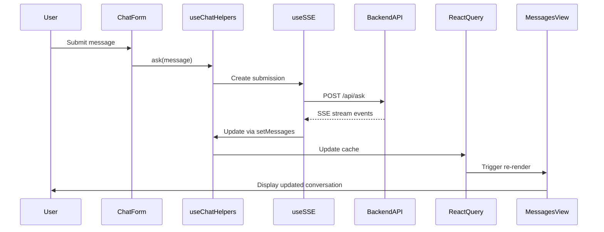
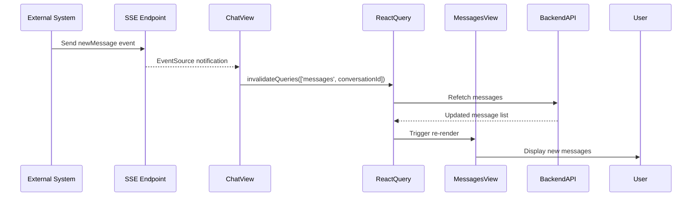

# LibreChat Conversation Updates Architecture

## Table of Contents

1. [Overview](#overview)
2. [Core Components](#core-components)
3. [Data Flow Architecture](#data-flow-architecture)
4. [State Management](#state-management)
5. [Real-Time Updates (SSE)](#real-time-updates-sse)
6. [Message Tree Structure](#message-tree-structure)
7. [Integration Patterns](#integration-patterns)
8. [External Message Handling](#external-message-handling)
9. [Development Guidelines](#development-guidelines)
10. [Troubleshooting](#troubleshooting)

## Overview

LibreChat's conversation update system is built on a multi-layered architecture that combines:

- **Server-Sent Events (SSE)** for real-time message streaming
- **React Query** for intelligent data caching and synchronization
- **Recoil** for granular state management
- **Tree-based message structure** for handling conversation branching
- **Index-based multi-conversation support** for concurrent chat sessions

### Key Design Principles

1. **Real-time First**: SSE-driven updates provide immediate user feedback
2. **State Consistency**: Multiple state layers remain synchronized
3. **Scalable Architecture**: Index-based separation enables multiple concurrent conversations
4. **Hierarchical Messages**: Tree structure supports conversation branching and threading
5. **Resilient Caching**: Smart cache management prevents data loss

## Core Components

### ChatView (`./ChatView.tsx`)

**Primary Responsibilities:**
- Orchestrates conversation display and real-time updates
- Manages SSE connections for external message updates
- Coordinates between chat helpers and state management
- Handles conversation navigation and lifecycle

**Key Implementation Details:**
```typescript
// Real-time SSE setup for external updates
React.useEffect(() => {
  if (!conversationId || !token) return;
  
  const sse = new EventSource(`/api/messages/stream?token=${token}`);
  
  sse.addEventListener('newMessage', (event) => {
    const data = JSON.parse(event.data);
    if (data.conversationId === conversationId) {
      queryClient.invalidateQueries(['messages', conversationId]);
    }
  });
  
  sse.addEventListener('newConversation', (event) => {
    const data = JSON.parse(event.data);
    queryClient.invalidateQueries(['conversations']);
    if (data.conversation?.conversationId === conversationId) {
      queryClient.invalidateQueries(['messages', conversationId]);
    }
  });
}, [conversationId, token, queryClient]);
```

### useChatHelpers (`~/hooks/Chat/useChatHelpers.ts`)

**Central hub for conversation management providing:**

```typescript
interface ChatHelpers {
  // State Management
  conversation: TConversation | null;
  setConversation: (convo: TConversation) => void;
  isSubmitting: boolean;
  setIsSubmitting: (submitting: boolean) => void;
  
  // Message Operations
  getMessages: () => TMessage[] | undefined;
  setMessages: (messages: TMessage[]) => void;
  latestMessage: TMessage | null;
  setLatestMessage: (message: TMessage) => void;
  
  // Chat Functions
  ask: (message: TMessage, options?: AskOptions) => void;
  regenerate: (options: RegenerateOptions) => void;
  handleStopGenerating: () => void;
  handleRegenerate: () => void;
  handleContinue: () => void;
  
  // UI State
  showPopover: boolean;
  setShowPopover: (show: boolean) => void;
  files: Map<string, ExtendedFile>;
  setFiles: (files: Map<string, ExtendedFile>) => void;
}
```

**Key Features:**
- **Dual Query Management**: Handles both `conversationId` and `'new'` conversation states
- **React Query Integration**: Provides `setMessages`/`getMessages` for cache manipulation
- **Index-based State**: Maintains independent state for each conversation index

### useAddedResponse (`~/hooks/Chat/useAddedResponse.ts`)

**Purpose:** Manages multi-model responses and additional conversation threads.

**Architecture Pattern:**
```typescript
// Index-based separation pattern
const currentIndex = useMemo(() => rootIndex + 1, [rootIndex]);

// Shared file context, independent conversation state
const {
  ask, regenerate, setMessages, getMessages,
  conversation, isSubmitting, setConversation, setIsSubmitting,
} = useAddedHelpers({ rootIndex, currentIndex });
```

### useSSE (`~/hooks/SSE/useSSE.ts`)

**Real-time message streaming with comprehensive event handling:**

**Event Processing Pipeline:**
```typescript
sse.addEventListener('message', (e: MessageEvent) => {
  const data = JSON.parse(e.data);
  
  if (data.final != null) {
    // Message completion
    finalHandler(data, submission);
  } else if (data.created != null) {
    // Initial message creation
    createdHandler(data, submission);
  } else if (data.sync != null) {
    // Database synchronization
    syncHandler(data, submission);
  } else if (data.type != null) {
    // Multi-modal content streaming
    contentHandler({ data, submission });
  } else {
    // Text content streaming
    messageHandler(text, submission);
  }
});
```

## Data Flow Architecture

### 1. Message Submission Flow



### 2. External Message Integration Flow



### 3. State Update Cascade

```typescript
// Complete update flow
setMessages([...existingMessages, newMessage])
  ↓
// React Query cache update
queryClient.setQueryData([QueryKeys.messages, conversationId], newMessages)
  ↓
// Recoil state update
setLatestMessage(newMessage)
  ↓
// UI re-render trigger
MessagesView renders with updated messagesTree
  ↓
// Message tree construction
buildTree({ messages: newMessages, fileMap })
  ↓
// Component tree update
MultiMessage → Message → MessageRender
```

## State Management

### Recoil Atom Families (`~/store/families.ts`)

**Conversation State:**
```typescript
const conversationByIndex = atomFamily<TConversation | null, string | number>({
  key: 'conversationByIndex',
  default: null,
  effects: [
    ({ onSet }) => {
      onSet(async (newValue) => {
        // Automatic localStorage persistence
        storeEndpointSettings(newValue);
        localStorage.setItem(
          `${LocalStorageKeys.LAST_CONVO_SETUP}_${index}`,
          JSON.stringify(newValue)
        );
        
        // URL state synchronization
        if (shouldUpdateParams) {
          const newParams = createChatSearchParams(newValue);
          const url = `${window.location.pathname}?${searchParams.toString()}`;
          window.history.pushState({}, '', url);
        }
      });
    }
  ]
});
```

**Message State Tracking:**
```typescript
// Latest message per conversation index
const latestMessageFamily = atomFamily<TMessage | null, string | number | null>({
  key: 'latestMessageByIndex',
  default: null,
});

// Active submission tracking
const submissionByIndex = atomFamily<TSubmission | null, string | number>({
  key: 'submissionByIndex',
  default: null,
});

// UI state management
const isSubmittingFamily = atomFamily({
  key: 'isSubmittingByIndex',
  default: false,
});

const showStopButtonByIndex = atomFamily<boolean, string | number>({
  key: 'showStopButtonByIndex',
  default: false,
});
```

### React Query Integration

**Message Fetching with Smart Caching:**
```typescript
export const useGetMessagesByConvoId = <TData = t.TMessage[]>(
  id: string,
  config?: UseQueryOptions<t.TMessage[], unknown, TData>,
): QueryObserverResult<TData> => {
  return useQuery<t.TMessage[], unknown, TData>(
    [QueryKeys.messages, id],
    async () => {
      const result = await dataService.getMessagesByConvoId(id);
      
      // Prevent data loss - prefer cache if more complete
      if (!location.pathname.includes('/c/new') && result?.length === 1) {
        const currentMessages = queryClient.getQueryData<t.TMessage[]>([QueryKeys.messages, id]);
        if (currentMessages && currentMessages?.length > 1) {
          return currentMessages;
        }
      }
      return result;
    },
    {
      refetchOnWindowFocus: false,
      refetchOnReconnect: false,
      refetchOnMount: false,
      ...config,
    },
  );
};
```

**Cache Management Strategy:**
- **Selective Invalidation**: Only invalidate affected conversation queries
- **Direct Manipulation**: Immediate cache updates for real-time feel
- **Conflict Resolution**: Smart cache comparison prevents data loss

## Real-Time Updates (SSE)

### Event Handlers (`~/hooks/SSE/useEventHandlers.ts`)

**Message Streaming Handler:**
```typescript
const messageHandler = useCallback((data: string, submission: EventSubmission) => {
  const { messages, userMessage, plugin, plugins, initialResponse, isRegenerate } = submission;
  const text = data ?? '';
  
  setIsSubmitting(true);
  
  // Accessibility announcements for screen readers
  const currentTime = Date.now();
  if (currentTime - lastAnnouncementTimeRef.current > MESSAGE_UPDATE_INTERVAL) {
    announcePolite({ message: 'composing', isStatus: true });
    lastAnnouncementTimeRef.current = currentTime;
  }
  
  if (isRegenerate) {
    setMessages([...messages, { ...initialResponse, text, plugin, plugins }]);
  } else {
    setMessages([...messages, userMessage, { ...initialResponse, text, plugin, plugins }]);
  }
}, [setMessages, announcePolite, setIsSubmitting]);
```

**Final Message Handler:**
```typescript
const finalHandler = useCallback((data: TFinalResData, submission: EventSubmission) => {
  const { requestMessage, responseMessage, conversation, runMessages } = data;
  
  setShowStopButton(false);
  setCompleted((prev) => new Set(prev.add(submission.initialResponse.messageId)));
  
  // Construct final message array
  let finalMessages: TMessage[] = [];
  if (runMessages) {
    finalMessages = [...runMessages];
  } else if (isRegenerate && responseMessage) {
    finalMessages = [...messages, responseMessage];
  } else if (requestMessage != null && responseMessage != null) {
    finalMessages = [...messages, requestMessage, responseMessage];
  }
  
  // Update both cache layers
  if (finalMessages.length > 0) {
    setMessages(finalMessages);
    queryClient.setQueryData<TMessage[]>(
      [QueryKeys.messages, conversation.conversationId],
      finalMessages,
    );
  }
  
  // Handle conversation navigation for new conversations
  const isNewConvo = conversation.conversationId !== submissionConvo.conversationId;
  if (isNewConvo && !isAddedRequest) {
    navigate(`/c/${conversation.conversationId}`, { replace: true });
  }
}, [setMessages, queryClient, navigate, isAddedRequest]);
```

**Content Handler (Multi-modal):**
```typescript
const useContentHandler = ({ setMessages, getMessages }) => {
  const messageMap = useMemo(() => new Map<string, TMessage>(), []);
  
  return useCallback(({ data, submission }) => {
    const { type, messageId, thread_id, conversationId, index } = data;
    
    // Incremental message building
    let response = messageMap.get(messageId);
    if (!response) {
      response = {
        ...(initialResponse as TMessage),
        parentMessageId: userMessage?.messageId ?? '',
        conversationId, messageId, thread_id,
      };
      messageMap.set(messageId, response);
    }
    
    // Handle different content types
    const part: ContentPart = textPart != null && typeof textPart === 'string' 
      ? { value: textPart } 
      : data[type];
    
    if (type === ContentTypes.IMAGE_FILE) {
      addFileToCache(queryClient, part as ImageFile & PartMetadata);
    }
    
    response.content = [...(response.content ?? [])];
    response.content[index] = { type, [type]: part } as TMessageContentParts;
    
    setMessages([...messages, response]);
  }, [queryClient, getMessages, messageMap, setMessages]);
};
```

## Message Tree Structure

### buildTree Utility (`~/utils/buildTree.ts`)

**Core Algorithm:**
```typescript
export default function buildTree({
  messages,
  fileMap,
}: {
  messages: TMessage[] | null;
  fileMap?: Record<string, TFile>;
}) {
  if (messages === null) return null;

  const messageMap: Record<string, ParentMessage> = {};
  const rootMessages: TMessage[] = [];
  const childrenCount: Record<string, number> = {};

  messages.forEach((message) => {
    const parentId = message.parentMessageId ?? '';
    childrenCount[parentId] = (childrenCount[parentId] || 0) + 1;

    const extendedMessage: ParentMessage = {
      ...message,
      children: [],
      depth: 0,
      siblingIndex: childrenCount[parentId] - 1,
    };

    // File attachment integration
    if (message.files && fileMap) {
      extendedMessage.files = message.files.map(
        (file) => fileMap[file.file_id ?? ''] ?? file
      );
    }

    messageMap[message.messageId] = extendedMessage;

    const parentMessage = messageMap[parentId];
    if (parentMessage) {
      parentMessage.children.push(extendedMessage);
      extendedMessage.depth = parentMessage.depth + 1;
    } else {
      rootMessages.push(extendedMessage);
    }
  });

  return rootMessages;
}
```

**Tree Structure Properties:**
- **Hierarchical Organization**: Parent-child relationships via `parentMessageId`
- **Depth Tracking**: Automatic depth calculation for nested rendering
- **Sibling Indexing**: Position tracking for message navigation
- **File Integration**: Seamless file metadata attachment

### Tree Usage Pattern

```typescript
// In ChatView.tsx
const { data: messagesTree = null, isLoading } = useGetMessagesByConvoId(conversationId ?? '', {
  select: useCallback(
    (data: TMessage[]) => {
      const dataTree = buildTree({ messages: data, fileMap });
      return dataTree?.length === 0 ? null : (dataTree ?? null);
    },
    [fileMap],
  ),
  enabled: !!fileMap,
});
```

## Integration Patterns

### 1. Query Invalidation Strategy

```typescript
// Targeted invalidation for external updates
const handleExternalMessage = (conversationId: string) => {
  queryClient.invalidateQueries(['messages', conversationId]);
};

// Immediate cache update for real-time feel
const handleStreamingMessage = (conversationId: string, messages: TMessage[]) => {
  queryClient.setQueryData(['messages', conversationId], messages);
};
```

### 2. State Synchronization Pattern

```typescript
// useChatHelpers coordinates between React Query and Recoil
const setMessages = useCallback((messages: TMessage[]) => {
  // Primary cache update
  queryClient.setQueryData<TMessage[]>([QueryKeys.messages, queryParam], messages);
  
  // Handle conversation transitions
  if (queryParam === 'new' && conversationId && conversationId !== 'new') {
    queryClient.setQueryData<TMessage[]>([QueryKeys.messages, conversationId], messages);
  }
}, [queryParam, queryClient, conversationId]);

// Recoil state managed separately
const [latestMessage, setLatestMessage] = useRecoilState(store.latestMessageFamily(index));
```

### 3. Error Handling Pattern

```typescript
// Comprehensive error handling in SSE
sse.addEventListener('error', (e) => {
  let data: TResData | undefined = undefined;
  
  try {
    data = JSON.parse(e.data) as TResData;
  } catch (error) {
    console.error('SSE parsing error:', error);
    setIsSubmitting(false);
    return;
  }
  
  // Create user-friendly error message
  const errorResponse = createErrorMessage({
    errorMetadata: parseErrorResponse(data),
    getMessages,
    submission,
  });
  
  setErrorMessages(conversationId, errorResponse);
});
```

## External Message Handling

### Current Integration Points

**1. Direct Cache Manipulation:**
```typescript
const addExternalMessage = (conversationId: string, message: TMessage) => {
  const currentMessages = queryClient.getQueryData<TMessage[]>(['messages', conversationId]) || [];
  const updatedMessages = [...currentMessages, message];
  queryClient.setQueryData(['messages', conversationId], updatedMessages);
  
  // Trigger UI updates
  queryClient.invalidateQueries(['messages', conversationId]);
};
```

**2. SSE Event Simulation:**
```typescript
const simulateExternalMessage = (conversationId: string, messageData: any) => {
  // Create synthetic SSE event
  const syntheticEvent = new MessageEvent('message', {
    data: JSON.stringify({
      conversationId,
      ...messageData
    })
  });
  
  // Dispatch to existing SSE handlers
  sseEventTarget.dispatchEvent(syntheticEvent);
};
```

**3. Custom Hook Integration:**
```typescript
export const useExternalMessageHandler = (conversationId: string, index: number = 0) => {
  const queryClient = useQueryClient();
  const setLatestMessage = useSetRecoilState(store.latestMessageFamily(index));
  const { setMessages } = useChatHelpers(index);
  
  const addExternalMessage = useCallback((message: TMessage) => {
    // Ensure message has required properties
    const completeMessage: TMessage = {
      messageId: message.messageId || v4(),
      conversationId,
      parentMessageId: message.parentMessageId || null,
      isCreatedByUser: message.isCreatedByUser ?? false,
      text: message.text || '',
      createdAt: message.createdAt || new Date().toISOString(),
      updatedAt: message.updatedAt || new Date().toISOString(),
      ...message,
    };
    
    // Update all state layers
    const currentMessages = queryClient.getQueryData<TMessage[]>(['messages', conversationId]) || [];
    const updatedMessages = [...currentMessages, completeMessage];
    
    // React Query cache
    queryClient.setQueryData(['messages', conversationId], updatedMessages);
    
    // Recoil state
    setLatestMessage(completeMessage);
    
    // Trigger UI updates
    queryClient.invalidateQueries(['messages', conversationId]);
  }, [conversationId, queryClient, setLatestMessage]);
  
  const updateExistingMessage = useCallback((messageId: string, updates: Partial<TMessage>) => {
    const currentMessages = queryClient.getQueryData<TMessage[]>(['messages', conversationId]) || [];
    const updatedMessages = currentMessages.map(msg =>
      msg.messageId === messageId ? { ...msg, ...updates } : msg
    );
    
    queryClient.setQueryData(['messages', conversationId], updatedMessages);
    queryClient.invalidateQueries(['messages', conversationId]);
  }, [conversationId, queryClient]);
  
  return {
    addExternalMessage,
    updateExistingMessage,
  };
};
```

## Development Guidelines

### 1. Adding New Message Sources

**Required Steps:**
1. **Maintain State Consistency**: Update both React Query cache and Recoil state
2. **Preserve Tree Structure**: Ensure `parentMessageId` relationships are correct
3. **Include File Context**: Integrate with `fileMap` for complete rendering
4. **Handle Index-based State**: Consider which conversation index receives messages
5. **Trigger UI Updates**: Use appropriate invalidation strategies

**Example Implementation:**
```typescript
const useCustomMessageSource = (conversationId: string) => {
  const { addExternalMessage } = useExternalMessageHandler(conversationId);
  
  useEffect(() => {
    const handleCustomMessage = (data: CustomMessageData) => {
      const message: TMessage = {
        messageId: v4(),
        conversationId,
        parentMessageId: data.parentId || null,
        isCreatedByUser: false,
        text: data.content,
        sender: data.source,
        createdAt: new Date().toISOString(),
        updatedAt: new Date().toISOString(),
      };
      
      addExternalMessage(message);
    };
    
    // Set up custom message source listener
    customMessageSource.on('message', handleCustomMessage);
    
    return () => {
      customMessageSource.off('message', handleCustomMessage);
    };
  }, [conversationId, addExternalMessage]);
};
```

### 2. State Management Best Practices

**React Query Guidelines:**
- Use query keys: `[QueryKeys.messages, conversationId]`
- Prefer `setQueryData` for immediate updates
- Use `invalidateQueries` for eventual consistency
- Handle conversation ID transitions carefully

**Recoil Guidelines:**
- Use appropriate atom families for index-based state
- Maintain consistency between `latestMessageFamily` and React Query
- Consider effect callbacks for side effects (localStorage, URL updates)

### 3. Error Handling Best Practices

```typescript
const handleMessageError = (error: Error, conversationId: string, submission?: TSubmission) => {
  console.error('Message handling error:', error);
  
  // Create user-friendly error message
  const errorMessage: TMessage = {
    messageId: v4(),
    conversationId,
    parentMessageId: submission?.userMessage?.messageId || null,
    isCreatedByUser: false,
    text: 'An error occurred while processing your message.',
    error: true,
    createdAt: new Date().toISOString(),
    updatedAt: new Date().toISOString(),
  };
  
  // Add error message to conversation
  const currentMessages = queryClient.getQueryData<TMessage[]>(['messages', conversationId]) || [];
  const updatedMessages = [...currentMessages, errorMessage];
  queryClient.setQueryData(['messages', conversationId], updatedMessages);
  
  // Stop any ongoing submissions
  setIsSubmitting(false);
};
```

## Troubleshooting

### Common Issues

**1. Messages Not Appearing**
- Check React Query cache: `queryClient.getQueryData(['messages', conversationId])`
- Verify conversation ID matches between source and display
- Ensure `queryClient.invalidateQueries` is called after updates

**2. State Inconsistency**
- Verify both React Query and Recoil state are updated
- Check that `latestMessage` atom is synchronized
- Ensure proper cleanup of SSE connections

**3. Message Tree Not Building**
- Verify `parentMessageId` relationships are correct
- Check that `fileMap` context is available
- Ensure messages have required properties (`messageId`, `conversationId`)

**4. SSE Connection Issues**
- Verify authentication token is valid
- Check network connectivity and SSE endpoint availability
- Monitor browser console for SSE error events

### Debug Utilities

```typescript
// React Query cache inspection
const debugMessages = (conversationId: string) => {
  const messages = queryClient.getQueryData(['messages', conversationId]);
  console.log('Cached messages:', messages);
};

// Recoil state inspection
const useDebugState = (index: number = 0) => {
  const conversation = useRecoilValue(store.conversationByIndex(index));
  const latestMessage = useRecoilValue(store.latestMessageFamily(index));
  const isSubmitting = useRecoilValue(store.isSubmittingFamily(index));
  
  console.log('Recoil state:', { conversation, latestMessage, isSubmitting });
};

// Message tree structure validation
const validateMessageTree = (messages: TMessage[]) => {
  const messageIds = new Set(messages.map(m => m.messageId));
  const orphans = messages.filter(m => 
    m.parentMessageId && !messageIds.has(m.parentMessageId)
  );
  
  if (orphans.length > 0) {
    console.warn('Orphaned messages found:', orphans);
  }
};
```

### Performance Considerations

**Optimization Guidelines:**
- Use `React.memo` for message components to prevent unnecessary re-renders
- Implement virtual scrolling for very long conversations
- Debounce scroll events and SSE event processing
- Consider message pagination for large conversation histories
- Use `useCallback` and `useMemo` appropriately in custom hooks

---

## Future Architecture Improvements

**Potential Enhancements:**
1. **Event Bus Pattern**: Centralized message event handling for multiple sources
2. **Plugin Architecture**: Formal plugin system for external message providers
3. **Message Source Metadata**: Track origin of messages for debugging and routing
4. **Conflict Resolution**: Handle simultaneous updates from multiple sources
5. **Offline Support**: Queue messages when connection is lost
6. **Message Versioning**: Support for message editing and revision history

This documentation serves as the foundation for understanding and extending LibreChat's conversation update system. The architecture's strength lies in its clear separation of concerns, making it suitable for complex integrations while maintaining performance and user experience. 